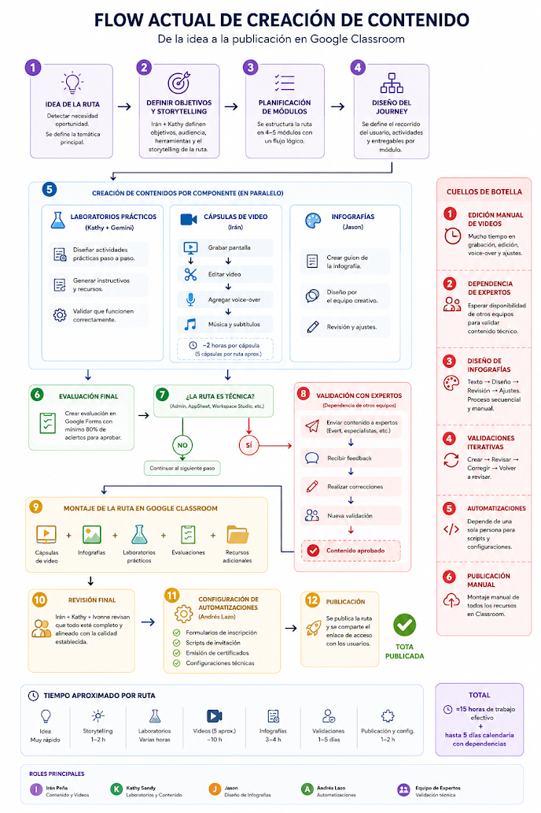
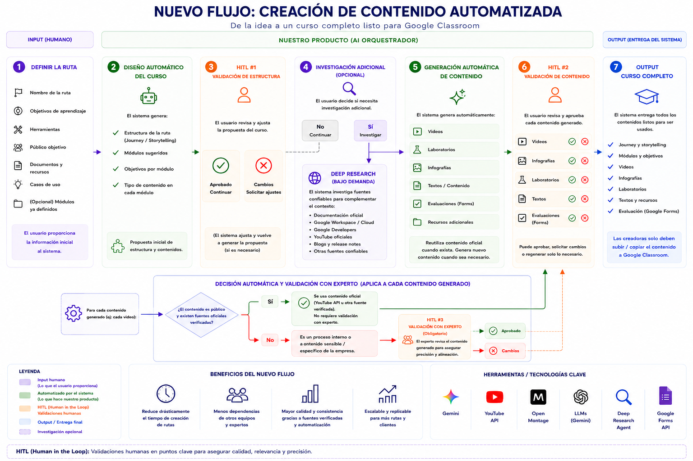

# AI Learning Content Studio — Xertica Education

> Plataforma de orquestación basada en Inteligencia Artificial que transforma una **idea de ruta de aprendizaje** en un **curso completo** listo para publicar en Google Classroom, automatizando el diseño de contenido, la investigación de fuentes oficiales y la generación de recursos educativos, con validaciones **Human-in-the-Loop (HITL)** en los puntos donde realmente aportan valor.

---

## Tabla de contenido

1. [Resumen ejecutivo](#1-resumen-ejecutivo)
2. [Equipo](#2-equipo)
3. [Contexto del problema](#3-contexto-del-problema)
4. [Problemáticas principales](#4-problemáticas-principales)
5. [Idea de negocio](#5-idea-de-negocio)
6. [Objetivos cuantificables](#6-objetivos-cuantificables)
7. [Flujo actual (AS-IS)](#7-flujo-actual-as-is)
8. [Nuevo flujo (TO-BE)](#8-nuevo-flujo-to-be)
9. [Arquitectura del sistema](#9-arquitectura-del-sistema)
10. [Skills del flujo de trabajo agéntico](#10-skills-del-flujo-de-trabajo-agéntico)
11. [Herramientas y tecnologías clave](#11-herramientas-y-tecnologías-clave)
12. [Beneficios esperados](#12-beneficios-esperados)

---

## 1. Resumen ejecutivo

**Proyecto:** AI Learning Content Studio
**Cliente / dominio:** Xertica — Education / Change Management
**Objetivo:** Desarrollar una plataforma de orquestación de IA que convierta una idea de ruta de aprendizaje en un curso completo (journey, módulos, videos, infografías, laboratorios, evaluaciones y Google Forms), entregado listo para publicarse en **Google Classroom**.

Como **primera prueba de concepto (PoC)**, el sistema se enfoca en automatizar la creación de contenido para las rutas de aprendizaje de **Change Management**, manteniendo un proceso **Human-in-the-Loop** para validar la estructura del curso y los materiales generados antes de su publicación.

---

## 2. Equipo

**AI Builders**

| Integrante | Rol referencial |
|---|---|
| Sebastián Amaro | AI Builder |
| Arantza Mendoza | AI Builder |
| Joseph Chuquipiondo | AI Builder |
| Santiago Mendivelso | AI Builder |
| Sebastián Moseres | AI Builder |
| Julio Cesar Toloza | AI Builder |

**Roles principales del flujo de contenido (referencia del proceso actual):**

| Rol | Responsabilidad |
|---|---|
| Irán Peña | Contenido y videos |
| Kathy Sandy | Laboratorios y contenido |
| Jason | Diseño de infografías |
| Andrés Lazo | Automatizaciones |
| Equipo de Expertos | Validación técnica |
| Ivonne | Revisión final de calidad |

---

## 3. Contexto del problema

El equipo de **Change Management** enfrenta un proceso de creación de contenido para rutas de aprendizaje que es **altamente manual** y depende de múltiples herramientas, personas y equipos externos.

La producción de una sola ruta requiere:

- Diseñar la estructura del curso.
- Investigar información confiable.
- Crear videos, infografías, laboratorios y evaluaciones.
- Coordinar validaciones con especialistas cuando el contenido es técnico.

Estas dependencias generan **cuellos de botella**, incrementan el tiempo de producción y dificultan la **escalabilidad** del proceso, especialmente cuando se busca personalizar rutas para distintos clientes o industrias.

### 3.1 Situación actual (Cómo — Acción)

Actualmente, el proceso de creación de contenido se realiza de forma **mayoritariamente manual**, apoyándose en distintas herramientas de IA de manera **aislada** y requiriendo validaciones constantes por parte del equipo y de expertos técnicos.

Se propone **automatizar** este proceso mediante una plataforma de orquestación de IA capaz de diseñar la estructura del curso, investigar información confiable y generar automáticamente los recursos educativos necesarios, manteniendo validaciones humanas **únicamente en los puntos donde aportan valor**.

### 3.2 Resultado buscado (Qué — Resultado)

Optimizar el proceso de creación de contenido para rutas de aprendizaje mediante la automatización de las tareas repetitivas y de mayor carga operativa. La plataforma permitirá generar automáticamente:

- Journey del curso
- Módulos
- Videos educativos
- Infografías
- Laboratorios prácticos
- Evaluaciones
- Google Forms
- Recursos complementarios

Todo el contenido será entregado **listo para ser publicado** posteriormente en Google Classroom.

---

## 4. Problemáticas principales

1. **Carga operativa y cognitiva:** Alta dependencia de flujos manuales para segmentar documentos y validar la veracidad de información técnica masiva.
2. **Limitaciones técnicas de la IA de video:** Los modelos actuales de Vertex AI generan clips de corta duración (~8 segundos), lo que exige soluciones de **concatenación automatizada** sin perder la consistencia visual ni el hilo temático.
3. **Dependencias entre equipos:** La creación de contenido requiere la participación y validación de especialistas técnicos, diseñadores y otros equipos, generando cuellos de botella que incrementan el tiempo de desarrollo y dificultan la escalabilidad.
4. **Fragmentación del flujo de trabajo:** Se usan múltiples herramientas independientes para investigación, generación, diseño y publicación, obligando al equipo a cambiar constantemente de plataforma y realizar integraciones manuales.
5. **Escalabilidad de la personalización:** Adaptar las rutas a diferentes clientes, industrias o casos de uso requiere reconstruir gran parte del contenido de forma manual, limitando la capacidad de ofrecer contenido personalizado de manera eficiente.

---

## 5. Idea de negocio

Desarrollar una **plataforma de orquestación basada en Inteligencia Artificial** que transforme una idea de ruta en un curso completo, automatizando:

- El **diseño del contenido** (journey, módulos, objetivos).
- La **investigación de fuentes oficiales** (Deep Research bajo demanda).
- La **generación de recursos educativos** (videos, infografías, laboratorios, evaluaciones, Forms).

**Propuesta de valor:**

- **De ~15 horas de trabajo efectivo + hasta 5 días calendario** (con dependencias de otros equipos) a un flujo mayormente automatizado con 2–3 puntos de validación humana.
- **Fuentes verificadas:** priorización de contenido oficial (Documentación oficial, Google Workspace/Cloud, Google Developers, YouTube oficiales, blogs y release notes) para minimizar alucinaciones.
- **Escalable y replicable** para más rutas, clientes e industrias.
- **Entrega estandarizada:** las creadoras solo deben subir/copiar el contenido a Google Classroom.

**Alcance de la PoC:** rutas de aprendizaje de **Change Management**, con Human-in-the-Loop para validar estructura y materiales.

---

## 6. Objetivos cuantificables

Indicadores propuestos para medir el éxito y desempeño de la automatización:

| Objetivo / Indicador | Meta cuantificable propuesta |
|---|---|
| **Reducción de tiempo de entrega** | Disminuir en un **[X]%** el tiempo total empleado en producción, edición y publicación por módulo. |
| **Automatización de sílabos** | Estructurar el **100%** de los temarios de forma automática a partir de la documentación provista. |
| **Gobernanza y calidad** | Limitar la revisión humana final a un máximo de **[X] minutos por video**, garantizando **0% de alucinaciones**. |
| **Seguridad de la información** | Garantizar que el **100%** de los insumos provengan de repositorios oficiales y seguros. |
| **Uso de fuentes verificadas** | Garantizar que el **100%** del contenido generado utilice documentación y recursos de fuentes oficiales cuando estén disponibles. |
| **Validación humana** | Limitar la intervención humana a **2–3 puntos de validación** (estructura del curso, validación con experto opcional, y contenido generado). |
| **Reducción de dependencias** | Disminuir significativamente la necesidad de coordinación con otros equipos, requiriendo expertos únicamente para contenido interno o altamente especializado. |

> Los campos **[X]** deben definirse con una línea base medida sobre el flujo actual.

---

## 7. Flujo actual (AS-IS)

**"Flow actual de creación de contenido — De la idea a la publicación en Google Classroom"**



### Etapas del flujo actual

1. **Idea de la ruta** — Detectar necesidad/oportunidad y definir la temática principal.
2. **Definir objetivos y storytelling** — Irán + Kathy definen objetivos, audiencia, herramientas y el storytelling de la ruta.
3. **Planificación de módulos** — Se estructura la ruta en 4–5 módulos con un flujo lógico.
4. **Diseño del journey** — Se define el recorrido del usuario, actividades y entregables por módulo.
5. **Creación de contenidos por componente (en paralelo):**
   - **Laboratorios prácticos** (Kathy + Gemini): diseñar actividades paso a paso, generar instructivos y validar que funcionen.
   - **Cápsulas de video** (Irán): grabar pantalla → editar → voice-over → música y subtítulos (~2 h por cápsula, 5 cápsulas por ruta aprox.).
   - **Infografías** (Jason): guion → diseño del equipo creativo → revisión y ajustes.
6. **Evaluación final** — Crear evaluación en Google Forms con mínimo 80% de aciertos para aprobar.
7. **¿La ruta es técnica?** — (Admin, AppSheet, Workspace Studio, etc.) Sí/No.
8. **Validación con expertos** (si es técnica) — Enviar contenido → recibir feedback → correcciones → nueva validación → contenido aprobado.
9. **Montaje de la ruta en Google Classroom** — Cápsulas de video + infografías + laboratorios + evaluaciones + recursos adicionales.
10. **Revisión final** — Irán + Kathy + Ivonne revisan calidad y alineación.
11. **Configuración de automatizaciones** (Andrés Lazo) — Formularios de inscripción, scripts de invitación, emisión de certificados, configuraciones técnicas.
12. **Publicación** — Se publica la ruta y se comparte el enlace de acceso. **Ruta publicada.**

### Cuellos de botella identificados

1. **Edición manual de videos** — mucho tiempo en grabación, edición, voice-over y ajustes.
2. **Dependencia de expertos** — esperar disponibilidad de otros equipos para validar contenido técnico.
3. **Diseño de infografías** — proceso secuencial y manual (texto → diseño → revisión → ajustes).
4. **Validaciones iterativas** — crear → revisar → corregir → volver a revisar.
5. **Automatizaciones** — dependencia de una sola persona para scripts y configuraciones.
6. **Publicación manual** — montaje manual de todos los recursos en Classroom.

### Tiempo aproximado por ruta

| Etapa | Tiempo |
|---|---|
| Idea | Muy rápido |
| Storytelling | 1–2 h |
| Laboratorios | Varias horas |
| Videos (5 aprox.) | ~10 h |
| Infografías | 3–4 h |
| Validaciones | 1–5 días |
| Publicación y config. | 1–2 h |
| **TOTAL** | **≈15 horas de trabajo efectivo + hasta 5 días calendario con dependencias** |

---

## 8. Nuevo flujo (TO-BE)

**"Nuevo flujo: creación de contenido automatizada — De la idea a un curso completo listo para Google Classroom"**



El nuevo flujo se organiza en tres grandes bloques: **Input (humano)** → **Producto (AI Orquestador)** → **Output (entrega del sistema)**.

### Etapas del nuevo flujo

1. **Definir la ruta (Input humano)** — El usuario proporciona: nombre de la ruta, objetivos de aprendizaje, herramientas, público objetivo, documentos y recursos, casos de uso y (opcional) módulos ya definidos.
2. **Diseño automático del curso** — El sistema genera: estructura de la ruta (journey/storytelling), módulos sugeridos, objetivos por módulo y tipo de contenido en cada módulo. *Salida: propuesta inicial de estructura y contenidos.*
3. **HITL #1 — Validación de estructura** — El usuario revisa y ajusta la propuesta: **Aprobado (continuar)** o **Cambios (solicitar ajustes)**. Si es necesario, el sistema ajusta y regenera la propuesta.
4. **Investigación adicional (opcional)** — El usuario decide si necesita investigación adicional:
   - **No → Continuar.**
   - **Sí → Investigar (Deep Research bajo demanda):** el sistema investiga fuentes confiables para complementar el contexto: documentación oficial, Google Workspace/Cloud, Google Developers, YouTube oficiales, blogs y release notes, y otras fuentes confiables.
5. **Generación automática de contenido** — El sistema genera automáticamente: videos, laboratorios, infografías, textos/contenido, evaluaciones (Forms) y recursos adicionales. Reutiliza contenido oficial cuando existe y genera contenido nuevo cuando es necesario.
6. **HITL #2 — Validación de contenido** — El usuario revisa y aprueba cada contenido generado (videos, infografías, laboratorios, textos, evaluaciones/Forms). Puede aprobar, solicitar cambios o regenerar solo lo necesario.
7. **Output — Curso completo** — El sistema entrega todos los contenidos listos para usarse: journey y storytelling, módulos y objetivos, videos, infografías, laboratorios, textos y recursos, evaluación (Google Forms). **Las creadoras solo deben subir/copiar el contenido a Google Classroom.**

### Decisión automática y validación con experto (aplica a cada contenido generado)

Para cada contenido generado (ej: cada video):

- **¿El contenido es público y existen fuentes oficiales verificadas?**
  - **Sí →** Se usa contenido oficial (YouTube API u otra fuente verificada). **No requiere validación con experto.**
  - **No →** Es un proceso interno o contenido sensible/específico de la empresa → **HITL #3 — Validación con experto (obligatorio):** el experto revisa el contenido generado para asegurar precisión y alineación → **Aprobado** o **Cambios**.

### Leyenda del diagrama

- 🟪 **Input humano** — lo que el usuario proporciona.
- 🟩 **Automatizado por el sistema** — lo que hace el producto.
- 🟧 **HITL (Human in the Loop)** — validaciones humanas.
- 🟦 **Output / entrega final.**
- 🟪 **Investigación opcional.**

> **HITL (Human in the Loop):** validaciones humanas en puntos clave para asegurar calidad, relevancia y precisión.

---

## 9. Arquitectura del sistema

La plataforma se estructura como un **orquestador de IA** que coordina una serie de agentes/skills especializados, con puntos de control humano (HITL) y priorización de fuentes oficiales.

### 9.1 Capas de la arquitectura

```
┌──────────────────────────────────────────────────────────────────────┐
│  CAPA DE ENTRADA (Input humano)                                        │
│  Nombre de ruta · Objetivos · Herramientas · Público · Documentos ·    │
│  Casos de uso · (Opcional) Módulos definidos                           │
└──────────────────────────────────────────────────────────────────────┘
                                 │
                                 ▼
┌──────────────────────────────────────────────────────────────────────┐
│  CAPA DE ORQUESTACIÓN (AI Orchestrator)                                │
│  Coordina el pipeline agéntico, gestiona el estado del curso,          │
│  enruta las validaciones HITL y decide fuente oficial vs. generación.  │
└──────────────────────────────────────────────────────────────────────┘
        │              │              │              │
        ▼              ▼              ▼              ▼
┌────────────┐ ┌────────────┐ ┌────────────┐ ┌────────────┐
│ Course     │ │ Deep       │ │ Content    │ │ Assessment │
│ Design     │ │ Research   │ │ Generation │ │ Generation │
│ Skill      │ │ Skill      │ │ Skills     │ │ Skill      │
└────────────┘ └────────────┘ └────────────┘ └────────────┘
                                 │
                                 ▼
┌──────────────────────────────────────────────────────────────────────┐
│  CAPA DE VALIDACIÓN (Human-in-the-Loop)                                │
│  HITL #1 Estructura · HITL #2 Contenido · HITL #3 Experto (condicional)│
└──────────────────────────────────────────────────────────────────────┘
                                 │
                                 ▼
┌──────────────────────────────────────────────────────────────────────┐
│  CAPA DE ENTREGA (Output)                                              │
│  Curso completo empaquetado → subir/copiar a Google Classroom          │
└──────────────────────────────────────────────────────────────────────┘
```

### 9.2 Componentes principales

| Componente | Responsabilidad |
|---|---|
| **AI Orchestrator** | Coordina el pipeline agéntico, mantiene el estado del curso, enruta HITL y aplica la regla de decisión "fuente oficial vs. contenido generado". |
| **Course Design Engine** | Genera estructura del journey, módulos, objetivos y tipo de contenido por módulo. |
| **Deep Research Agent** | Investigación bajo demanda sobre fuentes confiables (documentación oficial, Google Cloud/Workspace, Developers, YouTube oficiales, blogs, release notes). |
| **Content Generation** | Sub-agentes para video, infografías, laboratorios, textos y recursos. |
| **Video Pipeline** | Genera clips (Vertex AI, ~8s) y los **concatena** manteniendo consistencia visual y temática (Open Montage). |
| **Assessment Generator** | Crea evaluaciones y **Google Forms** (Google Forms API). |
| **HITL Gateway** | Gestiona los 3 puntos de validación humana (estructura, contenido, experto). |
| **Source Verifier** | Decide si el contenido es público/verificado o interno/sensible y enruta a validación con experto. |
| **Delivery Packager** | Empaqueta el curso completo listo para Google Classroom. |

### 9.3 Regla de decisión de fuentes

```
Para cada contenido generado:
    ¿Es público y existe fuente oficial verificada?
        SÍ  → usar contenido oficial (YouTube API / fuente verificada)
              → NO requiere validación con experto
        NO  → contenido interno o sensible
              → HITL #3: validación con experto (obligatoria)
```

---

## 10. Skills del flujo de trabajo agéntico

Cada **skill** encapsula una capacidad especializada del orquestador. Se ejecutan de forma secuencial o paralela según la etapa del flujo.

| # | Skill | Etapa | Entrada | Salida | HITL |
|---|---|---|---|---|---|
| 1 | **Route Intake** | Input | Datos del usuario (nombre, objetivos, herramientas, público, documentos, casos de uso) | Contexto estructurado de la ruta | — |
| 2 | **Course Design** | Diseño automático | Contexto de la ruta | Journey/storytelling, módulos, objetivos por módulo, tipo de contenido | HITL #1 |
| 3 | **Deep Research** | Investigación (opcional) | Solicitud de investigación | Fuentes oficiales verificadas y contexto complementario | — |
| 4 | **Video Generation** | Generación de contenido | Guion/objetivos por módulo | Videos educativos (clips concatenados, consistentes) | HITL #2 / #3 |
| 5 | **Infographic Generation** | Generación de contenido | Puntos clave del módulo | Infografías | HITL #2 |
| 6 | **Lab Generation** | Generación de contenido | Objetivos prácticos | Laboratorios prácticos paso a paso e instructivos | HITL #2 / #3 |
| 7 | **Text / Content Generation** | Generación de contenido | Objetivos y fuentes | Textos y contenido educativo | HITL #2 |
| 8 | **Assessment Generation** | Generación de contenido | Objetivos de aprendizaje | Evaluaciones + Google Forms | HITL #2 |
| 9 | **Source Verification** | Decisión automática | Contenido generado | Ruta: fuente oficial vs. validación con experto | HITL #3 (condicional) |
| 10 | **Delivery Packaging** | Output | Contenidos aprobados | Curso completo listo para Google Classroom | — |

### Detalle de skills clave

**Course Design Skill**
- Convierte la idea + documentos en una estructura pedagógica coherente.
- Genera journey/storytelling, módulos sugeridos, objetivos por módulo y tipo de contenido en cada módulo.
- **Gate HITL #1:** el usuario aprueba o solicita ajustes; el sistema regenera si es necesario.

**Deep Research Skill (bajo demanda)**
- Se activa solo cuando el usuario lo solicita.
- Consulta fuentes confiables: documentación oficial, Google Workspace/Cloud, Google Developers, YouTube oficiales, blogs y release notes.
- Objetivo: **100% de insumos desde repositorios oficiales y seguros** para minimizar alucinaciones.

**Video Generation Skill**
- Reto técnico: los modelos de Vertex AI generan clips de ~8s.
- Solución: **concatenación automatizada** de clips manteniendo consistencia visual y el hilo temático (Open Montage).
- Prioriza reutilizar videos oficiales (YouTube API) cuando existen.

**Assessment Generation Skill**
- Genera evaluaciones alineadas con los objetivos.
- Publica automáticamente en **Google Forms** (con criterios de aprobación, p. ej. ≥80% de aciertos).

**Source Verification Skill**
- Aplica la regla de decisión: contenido público/verificado → sin experto; contenido interno/sensible → **HITL #3 obligatorio**.

---

## 11. Herramientas y tecnologías clave

| Tecnología | Uso |
|---|---|
| **Gemini** | Diseño de curso, generación de contenido y razonamiento. |
| **YouTube API** | Búsqueda y reutilización de contenido oficial verificado. |
| **Open Montage** | Concatenación/edición automatizada de clips de video. |
| **LLMs (Gemini)** | Generación de texto, guiones, evaluaciones y estructura. |
| **Deep Research Agent** | Investigación sobre fuentes oficiales bajo demanda. |
| **Google Forms API** | Generación automática de evaluaciones. |
| **Vertex AI** | Generación de clips de video (~8s, con concatenación). |
| **Google Classroom** | Destino final de publicación (subida/copia por las creadoras). |

---

## 12. Beneficios esperados

- **Reduce drásticamente** el tiempo de creación de rutas.
- **Menos dependencias** de otros equipos y expertos.
- **Mayor calidad y consistencia** gracias a fuentes verificadas y automatización.
- **Escalable y replicable** para más rutas y clientes.
- **Entrega estandarizada:** contenido listo para subir a Google Classroom.

---

*Documento de proyecto — AI Learning Content Studio (Xertica Education). Versión inicial.*
