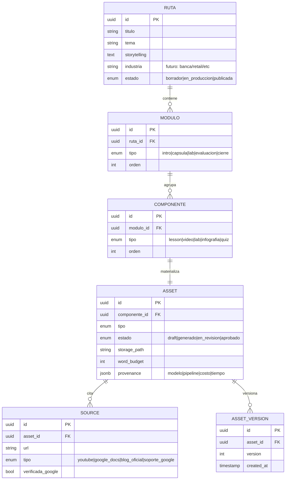
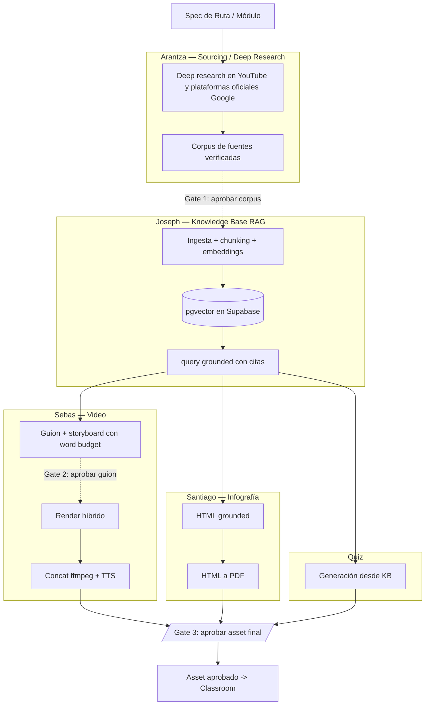
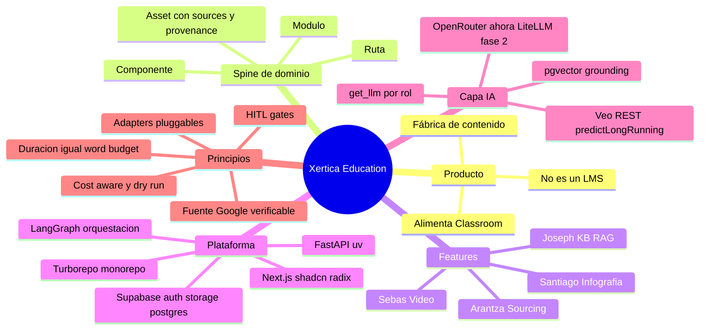
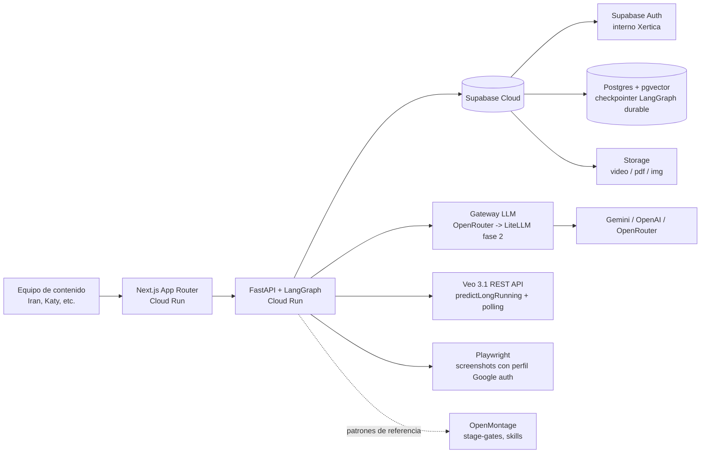
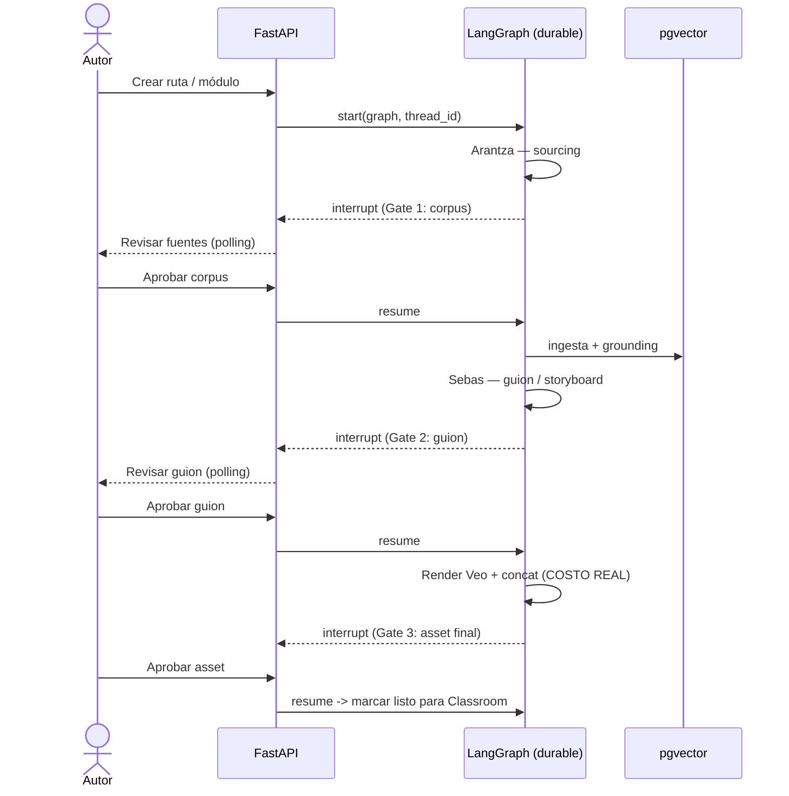

# Xertica Education — Arquitectura Objetivo

> **Versión:** 0.1 (borrador para revisión de equipo)
> **Alcance:** Arquitectura objetivo completa, con la rebanada **MVP** resaltada en cada sección.
> **Equipo:** Sebas (Video), Santiago (Infografía), Joseph (Knowledge Base), Arantza (Sourcing/Deep Research).
> **Runtime:** Google Cloud Run + Supabase Cloud.

---

## 1. Resumen ejecutivo

**Qué es.** Xertica Education es un **estudio interno de autoría de contenido**: toma la especificación de una ruta de aprendizaje y produce los *assets crudos* (cápsula de video, infografía, base de conocimiento, tutoriales con fuente) con **humano en el loop** en los puntos de decisión caros.

**Qué NO es.** No es un LMS. No reemplaza a Google Classroom: la entrevista es explícita en mantener el control de inscripciones, seguimiento de avance y registros de entrega en Classroom. El output de Xertica Education **alimenta** a Classroom, no compite con él.

**Por qué existe.** Ataca el cuello de botella real de la iniciativa Impulso: hoy la generación de contenido es lo más pesado — ~2 h por cápsula de video, 3–4 h por infografía, más laboratorios y dependencias externas. Ahí está el ROI del piloto.

**MVP (rebanada vertical).** Ruta 1 — *Inteligencia avanzada (Gemini + API Network)*, una de las rápidas — produciendo **un módulo completo end-to-end**: lesson + 1 cápsula de video (~2 min) + 1 infografía + 1 quiz + tutoriales con fuente verificada, pasando por los tres gates HITL. Objetivo: algo demo-able para la 2.ª reunión con Change Management que ejercite las 4 features contra el mismo spine.

---

## 2. Principios de arquitectura

Estos principios gobiernan todas las decisiones y se aplican transversalmente a las 4 features:

1. **Fuente Google verificable como requisito duro.** La información debe ser acreditada y verificable (fuentes Google), nunca de wikis abiertas. Cada asset lleva su `sources[]` como campo de primera clase.
2. **HITL en los puntos caros.** Interrupciones durables antes de gastar: aprobar corpus de fuentes, aprobar guion/storyboard antes del render de Veo, aprobar el asset final antes de marcarlo listo para Classroom.
3. **Duración como restricción, no como recorte posterior.** La longitud fluye como *word budget* desde el frontend hasta el agente de diseño instruccional; el contenido se construye acotado, no se poda después.
4. **Adapters pluggables en todo proveedor.** LLMs, renderizadores de escena y bases de conocimiento se acceden vía puertos intercambiables (`get_llm(role)`, `get_scene_renderer()`, `KnowledgeBase`).
5. **Cost-aware + dry-run.** Todo pipeline tiene modo dry-run de costo cero para validar prompts antes de comprometer gasto de API; el costo se registra por decisión en `provenance`.
6. **Sistemas OSS como servicios, no como código del monorepo.** OpenMontage y similares tienen su propio runtime y datastore; se referencian o se orquestan como servicios externos, no se vendorizan.

---

## 3. Vista de dominio — el *spine* que conecta a los 4 devs

Antes de repartir features, se fija el modelo que las 4 leen y escriben. Sin este spine compartido no hay producto, hay 4 demos sueltas.

`Ruta → Módulo (4–5) → Componente (Lesson | Video | Lab | Infografía | Quiz) → Asset`



**Tres campos que no son opcionales en `ASSET`:**

- `estado` — habilita los gates HITL.
- `sources[]` (relación `SOURCE`) — links **verificables de Google**; sin esto, el contenido no puede pasar a un cliente.
- `provenance` — qué pipeline/modelo lo generó, costo y tiempo; alimenta la trazabilidad de gasto.

> **Nota MVP:** el spine se implementa completo desde el día 1 (es barato y desbloquea a los 4 devs en paralelo), aunque el MVP solo cargue Ruta 1 con un módulo.

---

## 4. Vista de flujo — el DAG de las 4 features

El requisito de "fuente Google verificada" reordena al equipo: **el sourcing de Arantza es la capa de arriba, no una tool suelta.** El flujo natural es un DAG donde la KB de Joseph es el hub.



**Lectura del DAG:** Arantza produce el corpus verificado → Joseph lo convierte en la capa de grounding que todos consultan → Sebas y Santiago **consumen contenido ya aterrizado** (no inventan info no acreditada) → quizzes salen también de la KB. Esto es lo que garantiza que ningún asset se genere con fuentes que el cliente no pueda aceptar.

### Render híbrido por tipo de segmento (feature de Sebas)

Cada segmento de video exige una estrategia distinta — este es un aprendizaje clave, no un detalle:

| Segmento | Estrategia | Herramienta | Por qué |
|---|---|---|---|
| Conceptual / cinemático | Generativo | **Veo 3.1** (metáforas visuales, sin rostros) | Veo brilla en lo abstracto; evita *avatar drift* |
| Walkthrough de plataforma | Screenshots reales + Ken Burns + overlays | Playwright + compositor | Veo **alucina** UI real; nunca reproduce producto fielmente |
| Onboarding interactivo | Captura anotada + highlighting | Playwright + overlays | Requiere precisión sobre elementos reales |

> Continuidad del instructor entre segmentos: **voz TTS fija (voice ID)**, no una identidad de avatar persistente.

---

## 5. Mapa conceptual



---

## 6. Arquitectura de sistema y despliegue

**Runtime:** Google Cloud Run (contenedores serverless para web y API) + Supabase Cloud (auth, Postgres+pgvector, storage). Los sistemas OSS pesados quedan como servicios/referencia, fuera del monorepo.



### Monorepo (Turborepo)

```
xertica-education/
├── apps/
│   ├── web/          # Next.js 15 App Router + Tailwind + shadcn/radix
│   └── api/          # FastAPI + uv  (turbo lo corre vía script -> uv)
├── packages/
│   ├── types/        # tipos TS generados del schema Supabase
│   ├── ui/           # componentes compartidos
│   └── config/       # eslint, tsconfig, tailwind
├── supabase/         # migraciones, RLS, seed, buckets de storage
└── services/         # (fase 2) contenedores auxiliares / compositor Remotion
```

> **Fricción conocida:** Turborepo es JS/TS-nativo. `apps/api` (Python + uv) vive en el monorepo pero se orquesta con un `package.json` que shellea a `uv`. No se pelea por meter Python "puro" al grafo de tareas de Turbo.

---

## 7. Orquestación y HITL

Cada feature es un **subgrafo LangGraph**; un grafo padre *"ruta builder"* hace fan-out. El checkpointer durable vive en **Postgres/Supabase** (reemplaza el in-memory), lo que da persistencia de sesión entre reinicios de Cloud Run.

**Trabajos largos (Veo, deep research) — enfoque MVP ligero:** LangGraph durable + **polling desde FastAPI**. Sin cola dedicada por ahora. Pub/Sub o Cloud Tasks + workers quedan marcados como **fase 2** cuando el volumen lo justifique.



---

## 8. Estrategia de desacople de LLM

Dos capas, y no se confunden entre sí:

**Capa de aplicación — factory por rol, dirigido por config.** El código nunca hardcodea un modelo; pide un rol. Cambiar de modelo = editar YAML, cero código.

```yaml
# models.yaml — única fuente de verdad para elegir modelo
scriptwriter:        gemini-2.5-pro       # Sebas: guion
infographic_design:  claude-sonnet        # Santiago
researcher:          gemini-2.5-flash     # Arantza
quiz_generator:      gpt-4.1-mini
orchestrator:        gemini-2.5-flash
embeddings:          text-embedding-google
```

```python
# get_llm("scriptwriter") -> init_chat_model apuntando al gateway
llm = get_llm("scriptwriter")
```

**Capa operativa — gateway único.**
- **MVP:** OpenRouter directo detrás del factory (ya en uso, ~$20 de crédito).
- **Fase 2:** LiteLLM proxy self-hosted como única salida, con OpenRouter, Vertex/Gemini directo y OpenAI como *upstreams*. Centraliza keys, **budgets por dev/feature**, fallbacks, caché y logging de costo.

---

## 9. Responsabilidades por dev (todas contra el mismo spine)

| Dev | Feature | Entrada | Salida | Notas clave |
|---|---|---|---|---|
| **Arantza** | Sourcing / Deep Research | Spec de ruta | `SOURCE[]` verificados | Fase 2: apoyarse en el **Deep Research agent** gestionado de Google (Interactions API / A2A). Es fuente-Google por diseño. |
| **Joseph** | Knowledge Base (RAG) | Corpus aprobado | Grounding + citas | **MVP: pgvector en Supabase.** Puerto `KnowledgeBase` con adapter **Gemini Enterprise / NotebookLM** como fase 2 (bloqueado hoy por permisos de licencia). |
| **Sebas** | Video | Contenido grounded | Cápsula ~2 min | Pipeline propio (Python + Veo 3.1 REST); **OpenMontage solo como referencia** de patrones (stage-gates, instruction-driven). Render híbrido por segmento. |
| **Santiago** | Infografía | Contenido grounded | PDF | HTML grounded → PDF vía LLM. |

---

## 10. Registro de decisiones (ADR resumido)

| # | Decisión | Razón | Estado |
|---|---|---|---|
| 1 | OpenMontage como **referencia**, no dependencia | Licencia **AGPLv3** (riesgo si se productiza para clientes) + paradigma agent-driven que no encaja como librería en FastAPI. | ✅ Cerrada |
| 2 | KB con **pgvector en Supabase** (no open-notebook, no Gemini Enterprise aún) | open-notebook usa SurrealDB (choca con el estándar Supabase). No hay permisos para habilitar licencia de Gemini Enterprise / NotebookLM Enterprise hoy. | ✅ Cerrada |
| 3 | KB detrás de puerto `KnowledgeBase` | Permite migrar a Gemini Enterprise (grounding + citas nativas Google) sin reescribir consumidores. | ✅ Cerrada |
| 4 | MVP = **rebanada vertical** (Ruta 1, 1 módulo) | Ejercita las 4 features contra el spine y produce demo para Change Management. | ✅ Cerrada |
| 5 | Jobs largos: **LangGraph durable + polling** (sin cola) | Suficiente para el volumen del MVP; cola dedicada = fase 2. | ✅ Cerrada |
| 6 | Gateway LLM: OpenRouter ahora, **LiteLLM fase 2** | Empezar simple; centralizar budgets/fallbacks cuando haya varios devs consumiendo. | ✅ Cerrada |

---

## 11. Roadmap por fases

**Fase 1 — MVP (rebanada vertical)**
Spine completo · Ruta 1 / 1 módulo end-to-end · Arantza→KB(pgvector)→Sebas/Santiago/Quiz · 3 gates HITL · OpenRouter + `get_llm(role)` · Veo generativo (segmento conceptual) + screenshots Playwright · deploy en Cloud Run + Supabase Cloud.

**Fase 2 — Robustez y escala**
LiteLLM proxy con budgets · adapter `KnowledgeBase` → Gemini Enterprise (si se consiguen licencias) · Deep Research agent gestionado para Arantza · cola dedicada (Pub/Sub / Cloud Tasks) · compositor **Remotion** para segmentos screenshot y overlays animados.

**Fase 3 — Producto**
Rutas 2–7 · videos hasta ~10 min · rutas personalizadas por industria (banca, retail, finanzas) · métrica de adopción de herramientas antes/después vía consola de admin.

---

## 12. Supuestos y preguntas abiertas

**Supuestos vigentes (corregir si aplica):**
- Auth: Supabase Auth, uso interno (empleados Xertica).
- Storage binario: Supabase Storage.
- Playwright con perfil Google autenticado persistente para screenshots de rutas técnicas.
- Modelo de embeddings vía el mismo gateway; pgvector como store.
- El pipeline de video de Sebas se construye desde cero (Python + Veo 3.1 REST con `predictLongRunning` y polling asíncrono).

**Abiertas:**
- ¿Cómo se entrega el asset aprobado a Classroom hoy? (¿Apps Script de Andrés Lazo, subida manual, API?) — define la frontera "listo para Classroom".
- ¿La verificación "fuente Google" es automática (dominios permitidos) o requiere validación humana en el Gate 1?
- ¿Límite de costo por ruta/módulo para el dry-run vs. run real?
