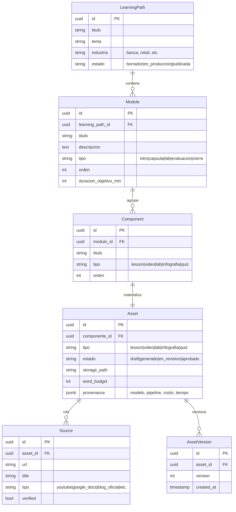

# Xertica Education — Documento de Arquitectura Consolidado

> **Versión:** 1.0 (Línea base para agentes de desarrollo)  
> **Alcance:** Arquitectura general y especificaciones del MVP.  
> **Runtime:** Google Cloud Run + Supabase Cloud.

---

## 1. Introducción y Alcance

**Qué es.** Xertica Education es un **estudio interno de autoría de contenido educativo** que ayuda a equipos internos a crear materiales didácticos de alta calidad. A partir del spec de una ruta de aprendizaje y recursos de entrada, el sistema genera de forma asistida cápsulas de video, infografías, bases de conocimiento, cuestionarios y laboratorios prácticos. Integra un flujo de **Humano en el Loop (HITL)** para control de costos y revisión de calidad en puntos de decisión críticos.

**Qué NO es.** No es un LMS (Learning Management System). No compite con Google Classroom, sino que lo alimenta. Classroom mantiene el control de inscripciones, calificaciones y entrega de tareas; Xertica Education provee los *assets* aprobados listos para cargarse en Classroom.

**El MVP (Piloto).** Consiste en una rebanada vertical enfocada en la **Ruta 1 (Inteligencia avanzada con Gemini + API Network)**. El objetivo es generar un módulo completo de forma integrada: Lesson + 1 Cápsula de video (~2 min) + 1 Infografía + 1 Quiz + 1 Guía de Laboratorio (Lab) grounded en fuentes validadas, pasando por los Gates humanos.

---

## 2. Principios de Arquitectura

1. **Fuente de Grounding Verificable:** Todo el contenido generado debe estar estrictamente anclado en fuentes oficiales y confiables (por ejemplo, documentación oficial de Google). Las fuentes de wikis abiertas no son válidas.
2. **Humano en el Loop (HITL) en Gates Estratégicos:** Interrupciones durables antes de gastar recursos costosos. Se requiere validación humana para aprobar la estructura de la ruta, el corpus de fuentes, el guion/storyboard del video y los assets finales.
3. **Control de Longitud por Presupuesto de Palabras (Word Budget):** La duración de los assets de audio/video y la longitud de los textos se restringen en el diseño instruccional inicial; el contenido se construye acotado desde el inicio en lugar de podarse posteriormente.
4. **Desacople mediante Interfaces (Adapters Pluggables):** El acceso a LLMs, proveedores de almacenamiento y motores de generación/renderizado de escena se expone mediante interfaces abstractas para facilitar intercambios futuros.
5. **Enfoque Mock-First:** Las capacidades deben poder validarse con implementaciones Mock conformes al contrato técnico para desacoplar el desarrollo de la interfaz de usuario de las integraciones con APIs externas y de IA.

---

## 3. Modelo de Dominio — El *Spine*

El *Spine* es la estructura de datos unificada sobre la cual operan todos los componentes del sistema. Las tablas e interfaces de persistencia utilizan nomenclatura en inglés para evitar conflictos y mantener uniformidad técnica.



*   **LearningPath / Ruta de Aprendizaje:** Representa el curso o ruta global.
*   **Module / Módulo:** Divisiones lógicas del curso.
*   **Component / Componente:** Especificaciones o intenciones de contenido.
*   **Asset / Recurso:** El archivo físico o resultado final generado (e.g., video renderizado, PDF, JSON estructurado), el cual incluye trazabilidad de origen (`provenance`) e historial de versiones (`AssetVersion`).
*   **Source / Fuente:** Citas que sustentan el grounding del Asset.

---

## 4. Arquitectura del Sistema (Vista de Capas)

El despliegue del sistema se realiza sobre infraestructura serverless y administrada en la nube:

*   **Frontend (Aplicación Web):** Next.js 15 App Router con Tailwind CSS (v4) y shadcn/ui. Se ejecuta en **Google Cloud Run**. Se comunica exclusivamente con la API de FastAPI.
*   **Backend (API de Orquestación):** FastAPI y Python administrados con `uv`. Se ejecuta en **Google Cloud Run**. Expone controladores y coordina los flujos de generación y acceso a datos.
*   **Base de Datos y Autenticación:** **Supabase Cloud**, utilizando PostgreSQL con la extensión `pgvector` para el almacenamiento de vectores y búsqueda semántica, Supabase Auth para usuarios internos, y Supabase Storage para los archivos generados.
*   **Gateway LLM y APIs Externas:** Consumo de modelos a través de un gateway centralizado (inicialmente OpenRouter, permitiendo fallback y portabilidad) y servicios de generación especializada (como Google Veo para video).

---

## 5. Puntos de Control y Gates Humanos (HITL)

El desarrollo del contenido sigue un flujo secuencial regulado por cuatro compuertas (Gates) que requieren intervención humana para avanzar:

*   **Gate 0 — Route Builder (Curación de la Estructura):** El usuario introduce una idea general o carga un material inicial de referencia. El sistema propone un árbol curricular completo (`LearningPath -> Modules -> Components`). El autor cura manualmente la estructura en un editor tipo árbol (reordenando, seleccionando componentes conceptuales o prácticos y estimando costos preliminares) antes de guardar y habilitar la generación.
*   **Gate 1 — Corpus Sourcing (Validación de Fuentes):** La capa de sourcing extrae fuentes candidatas a partir del spec aprobado. El autor aprueba o descarta enlaces individuales para garantizar que la Base de Conocimiento (KB) de ese módulo se nutra únicamente de fuentes válidas y oficiales.
*   **Gate 2 — Script & Storyboard (Aprobación de Guion):** Antes de ejecutar los procesos de renderizado de video, el autor revisa el guion segmentado y los bosquejos visuales. Se valida el cumplimiento de las restricciones de tiempo y presupuesto de palabras, y se define qué escenas usarán diapositivas, capturas de pantalla de Playwright o clips de Google Veo (según se detalla en el [Video Creation PRD](file:///Users/sebastianmoseres/Desktop/All%20Folders/Xertica/Xertica%20Education/xertica-education/docs/prd/video_creation_prd.md)).

*   **Gate 3 — Asset Review (Revisión Final):** Una vez generados todos los recursos del módulo (PDF de infografía, video conceptual, quiz, guía de laboratorio), el autor los inspecciona en la interfaz interactiva. Puede aprobar cada asset individualmente, rechazarlo para regeneración o dar el visto bueno global para clasificar el módulo como *Listo para Google Classroom*.

---

## 6. Estructura del Proyecto (Monorepo Turborepo)

El monorepo organiza las aplicaciones y paquetes compartidos de la siguiente forma:

```
xertica-education/
├── apps/
│   ├── web/          # Frontend Next.js 15 (URL routes: /nueva-ruta, /ruta/[id])
│   └── api/          # Backend FastAPI + uv
│       ├── config/         # Configuración central (settings.py)
│       ├── routers/        # Controladores HTTP expuestos (learning_paths, workflow, jobs)
│       ├── workflows/      # Orquestadores y subgrafos de generación
│       ├── services/       # Lógica de negocio (video, kb, infographic, lesson, quiz, lab, jobs, learning_path)
│       │   # Estructura de cada servicio: interface.py, service.py, mock.py
│       ├── repositories/   # Acceso y transacciones de base de datos
│       ├── models/         # Modelos de datos
│       │   ├── domain/     # Estructuras de negocio (spine)
│       │   └── dto/        # Contratos de red (request/response)
│       └── adapters/       # Clientes externos (llm, storage, parser, renderer)
├── packages/
│   ├── types/        # Tipos TS sincronizados con el schema de base de datos
│   └── ui/           # Componentes web comunes
├── supabase/         # Migraciones SQL y configuración de base de datos
└── docs/             # Especificaciones y arquitectura
```

> **Regla de Desacople entre Servicios:** Los servicios de capacidades de negocio (e.g. `video`, `infographic`, `kb`) son mutuamente independientes y no deben llamarse de forma directa entre sí. Su comunicación y sincronización se delega a las capas superiores de orquestación (`workflows`).

---

## 7. Desacople y Configuración de LLM

La aplicación no vincula directamente nombres de modelos de IA en el código duro. En su lugar, el backend utiliza roles funcionales abstractos (e.g., `route_structurer`, `scriptwriter`, `researcher`) para invocar a los modelos. 

La resolución de qué modelo comercial específico (e.g., `gemini-2.5-pro`, `gemini-2.5-flash`) atiende cada rol se configura de manera dinámica a nivel de entorno cargando la estructura `model_names` en la clase de configuración `Settings`, ofreciendo flexibilidad para cambiar de modelo sin alterar la lógica de negocio.

---

## 8. Matriz de Responsabilidades y Owners

Para garantizar la organización paralela del equipo y la resolución limpia de conflictos en el monorepo, se asignan owners específicos a cada sección de código:

| Feature / Módulo de Código | Owner | Responsabilidad Principal |
| :--- | :--- | :--- |
| **Learning Path & Workflows** | Sebas | Modelado de datos global (Spine), orquestación general de pipelines. |
| **Jobs Service** | Joseph | Mecanismo de persistencia y seguimiento de tareas en segundo plano. |
| **Knowledge Base (KB)** | Joseph | Ingesta, indexación vectorial, almacenamiento y consultas con citas (RAG). |
| **Sourcing & Deep Research** | Arantza | Pipelines de búsqueda, recuperación y estructuración de fuentes. |
| **Video Production** | Sebas | Generación de guiones, storyboard y renderizado de video asíncrono. |
| **Infographics** | Santiago | Composición HTML y renderizado de infografías a formato PDF. |
| **Instructional Design (Lesson/Quiz/Lab)** | Santiago | Generación de contenido didáctico basado en texto plano estructurado. |

---

## 9. Criterios de Aceptación (DoD) y Validación

Cada servicio o componente desarrollado en el monorepo se considera finalizado cuando cumple las siguientes condiciones:

*   **Contratos estables:** Exponer endpoints conformes a los esquemas DTO definidos (`requests.py` y `responses.py`).
*   **Aislamiento de fallos (Mocks):** Implementar la clase `mock.py` de la interfaz para que el frontend pueda ejecutar el flujo de integración de forma local sin requerir credenciales de APIs de pago.
*   **Pruebas de integración:** El flujo end-to-end de los 4 Gates debe poder completarse utilizando mocks para comprobar la reactividad y las transiciones del frontend.

---

## 10. Registro de Decisiones de Arquitectura (ADRs)

Los ADRs viven como archivos numerados en [`docs/adr/`](../adr/). Índice:

*   [ADR-0001](../adr/0001-pgvector-supabase-knowledge-base.md): pgvector en Supabase como Knowledge Base.
*   [ADR-0002](../adr/0002-mocks-first-class-citizens.md): Mocks como first-class citizens.
*   [ADR-0003](../adr/0003-domain-naming-in-english.md): Nomenclatura del dominio en inglés.
