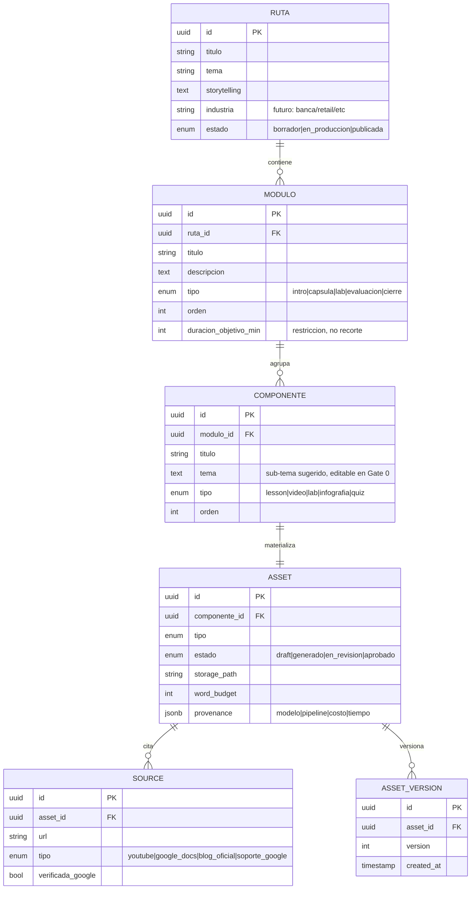
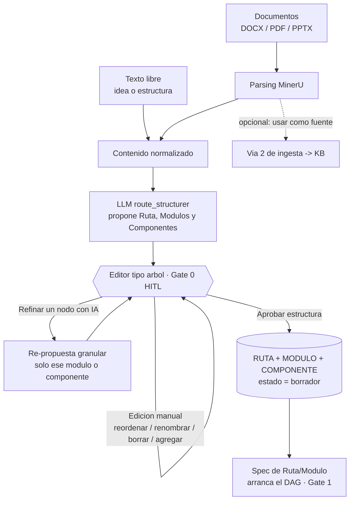
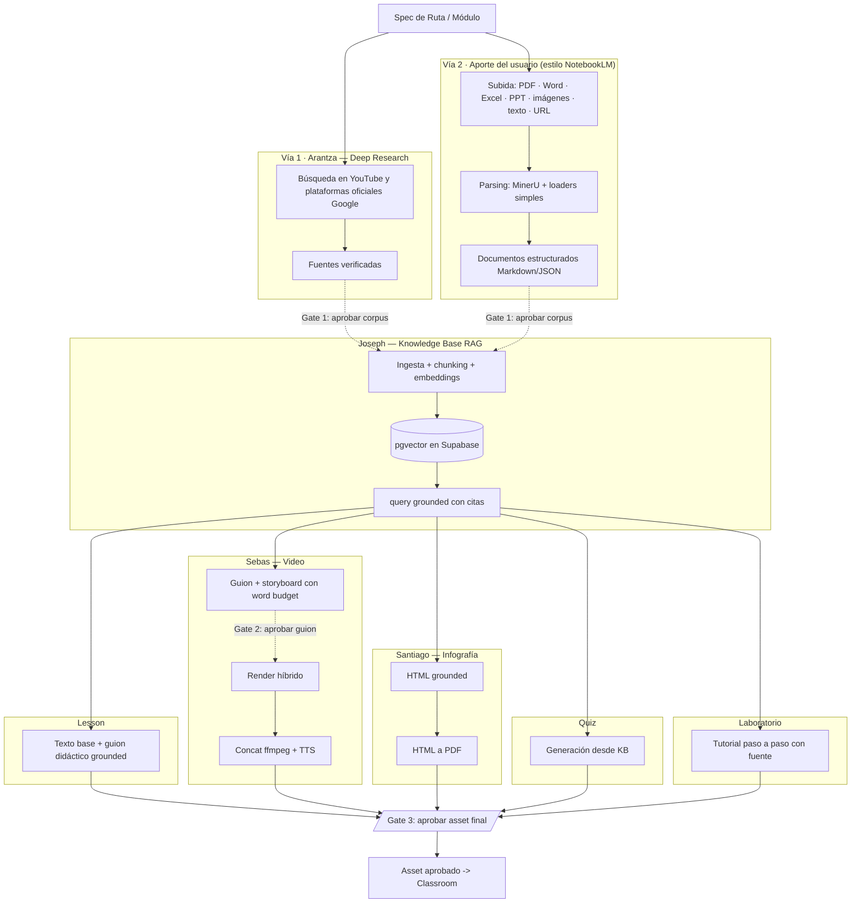
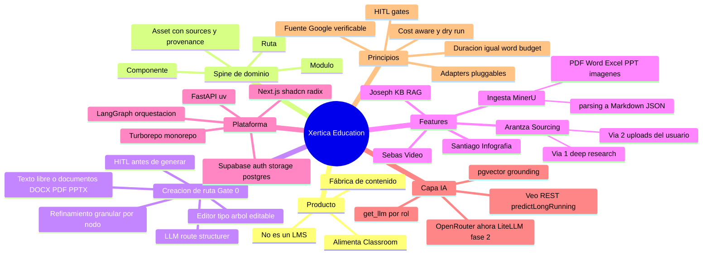
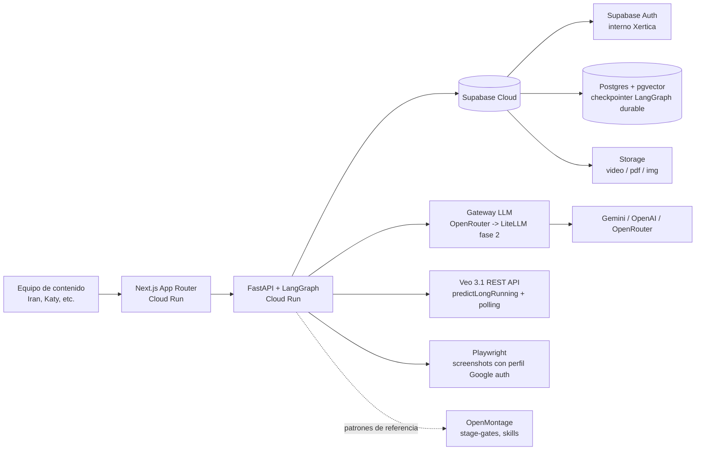
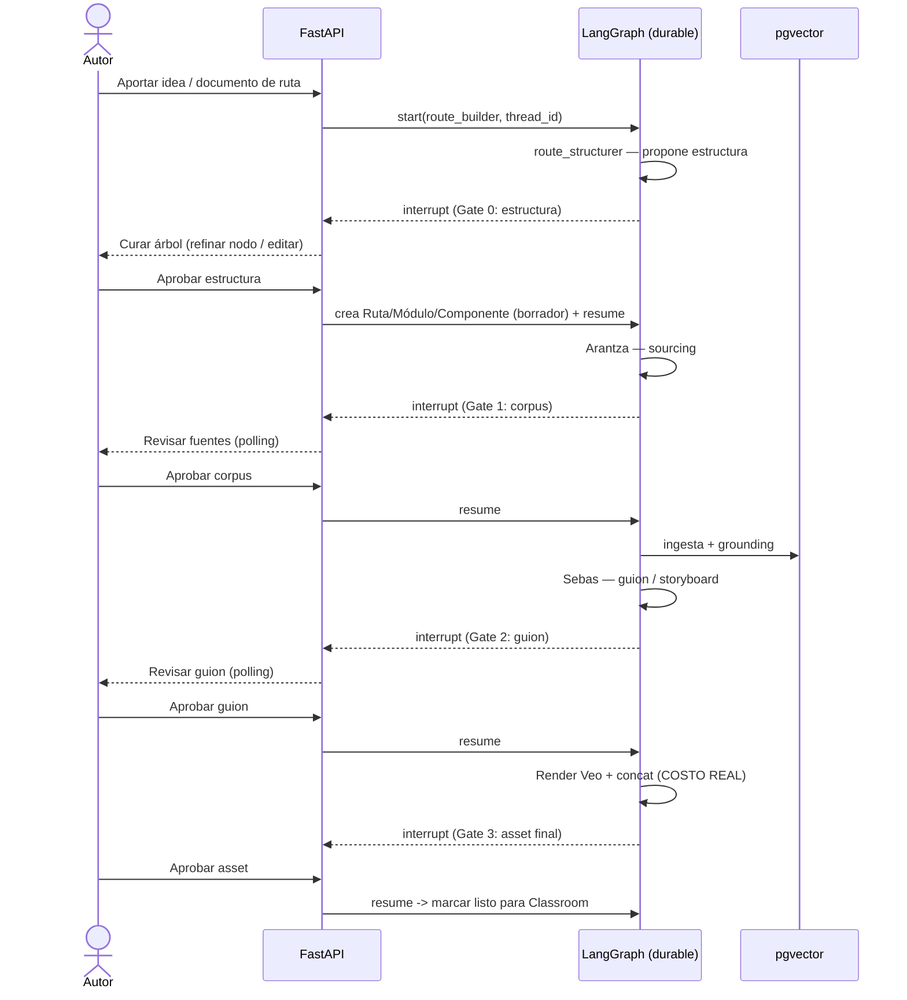

# Xertica Education — Arquitectura Objetivo

> **Versión:** 0.2 (borrador para revisión de equipo)
> **Alcance:** Arquitectura objetivo completa, con la rebanada **MVP** resaltada en cada sección.
> **Equipo:** Sebas (Video), Santiago (Infografía), Joseph (Knowledge Base), Arantza (Sourcing/Deep Research).
> **Runtime:** Google Cloud Run + Supabase Cloud.

> **Objetivo vs. implementado.** Este documento describe la arquitectura **objetivo**. Lo que ya existe en el monorepo hoy está resumido en §7 ("Lineamientos y estado actual") y detallado en [`CLAUDE.md`](../../CLAUDE.md) y los ADRs de [`docs/adr/`](../adr/). Regla de lectura: si una sección describe LangGraph, Veo, MinerU, Supabase Auth/Storage o `packages/`, es **objetivo, aún no implementado**. El *Spine* (§3), la persistencia Postgres (§7) y el gestor **pnpm** ya están construidos.

---

## 1. Resumen ejecutivo

**Qué es.** Xertica Education es un **estudio interno de autoría de contenido**: toma la especificación de una ruta de aprendizaje y produce los *assets crudos* (cápsula de video, infografía, base de conocimiento, tutoriales con fuente) con **humano en el loop** en los puntos de decisión caros.

**Qué NO es.** No es un LMS. No reemplaza a Google Classroom: la entrevista es explícita en mantener el control de inscripciones, seguimiento de avance y registros de entrega en Classroom. El output de Xertica Education **alimenta** a Classroom, no compite con él.

**Por qué existe.** Ataca el cuello de botella real de la iniciativa Impulso: hoy la generación de contenido es lo más pesado — ~2 h por cápsula de video, 3–4 h por infografía, más laboratorios y dependencias externas. Ahí está el ROI del piloto.

**MVP (rebanada vertical).** Ruta 1 — *Inteligencia avanzada (Gemini + API Network)*, una de las rápidas — produciendo **un módulo completo end-to-end**: lesson + 1 cápsula de video (~2 min) + 1 infografía + 1 quiz + tutoriales con fuente verificada, pasando por los tres gates HITL. La KB se alimenta por **dos vías**: el deep research de Arantza y el aporte de archivos del propio usuario (estilo NotebookLM). Objetivo: algo demo-able para la 2.ª reunión con Change Management que ejercite las 4 features contra el mismo spine.

---

## 2. Principios de arquitectura

Estos principios gobiernan todas las decisiones y se aplican transversalmente a las 4 features:

1. **Fuente Google verificable como requisito duro.** La información debe ser acreditada y verificable (fuentes Google), nunca de wikis abiertas. Cada asset lleva su `sources[]` como campo de primera clase.
2. **HITL en los puntos caros.** Interrupciones durables antes de gastar: aprobar corpus de fuentes, aprobar guion/storyboard antes del render de Veo, aprobar el asset final antes de marcarlo listo para Classroom.
3. **Duración como restricción, no como recorte posterior.** La longitud fluye como *word budget* desde el frontend hasta el agente de diseño instruccional; el contenido se construye acotado, no se poda después.
4. **Adapters pluggables en todo proveedor.** LLMs, renderizadores de escena y bases de conocimiento se acceden vía puertos intercambiables (`get_llm(role)`, `get_scene_renderer()`, `KnowledgeBase`).
5. **Cost-aware + dry-run.** Todo pipeline tiene modo dry-run de costo cero para validar prompts antes de comprometer gasto de API; el costo se registra por decisión en `provenance`.
6. **Sistemas OSS como servicios, no como código del monorepo.** OpenMontage y similares tienen su propio runtime y datastore; se referencian o se orquestan como servicios externos, no se vendorizan.

---

## 3. Vista de dominio — el *spine* que conecta a los 4 devs

Antes de repartir features, se fija el modelo que las 4 leen y escriben. Sin este spine compartido no hay producto, hay 4 demos sueltas.

`Ruta → Módulo (4–5) → Componente (Lesson | Video | Lab | Infografía | Quiz) → Asset`



**Tres campos que no son opcionales en `ASSET`:**

- `estado` — habilita los gates HITL.
- `sources[]` (relación `SOURCE`) — links **verificables de Google**; sin esto, el contenido no puede pasar a un cliente.
- `provenance` — qué pipeline/modelo lo generó, costo y tiempo; alimenta la trazabilidad de gasto.

> **Nota MVP:** el spine se implementa completo desde el día 1 (es barato y desbloquea a los 4 devs en paralelo), aunque el MVP solo cargue Ruta 1 con un módulo.

> **✅ Estado (implementado):** las 6 tablas del spine (`learning_paths`, `modules`, `components`, `assets`, `sources`, `asset_versions`) + `jobs` existen en `supabase/migrations` y están **aplicadas en Supabase Cloud**, con RLS activo. Ver [ADR-0004](../adr/0004-supabase-postgres-persistence.md) y [ADR-0005](../adr/0005-full-spine-schema.md). **Caveat de `estado`:** hoy la Ruta lleva el vocab de aprobación del frontend (`borrador/generado/en-revision/aprobado`) — es *interino*; en el spine la aprobación vive en `ASSET` (`draft/generado/en_revision/aprobado`) y la Ruta debería llevar ciclo de vida (`borrador/en_produccion/publicada`). Migrar ese split requiere desacoplar `RouteStatus` del `ContentStatus` en el frontend.

> **Campos que habilitan la curación (Gate 0, §4):** `MODULO.titulo` + `MODULO.descripcion` + `MODULO.duracion_objetivo_min` y `COMPONENTE.titulo` + `COMPONENTE.tema` son lo que el editor de árbol edita. Sin ellos la estructura no sería curable; con ellos, el mismo spine sirve para la creación *y* para la generación.

---

## 4. Creación de ruta — Gate 0 (Route Builder HITL)

Antes de que exista contenido que generar, tiene que existir una **estructura de ruta**. El spine (§3) modela *qué* es una ruta; esta sección modela *cómo nace*: un humano aporta una idea o un borrador, un LLM lo convierte en una estructura completa, y el mismo humano la **cura** en un editor antes de aprobarla. Es el **Gate 0**: el primer punto humano-en-el-loop, previo al Gate 1 de corpus.

**Por qué es un gate y no un formulario.** La estructura —módulos, orden, componentes, duraciones— determina todo el gasto aguas abajo. Curarla bien (quitar un submódulo redundante, reordenar, ajustar qué componentes lleva cada módulo) es la palanca de costo más barata del sistema: corrige *antes* de generar, no después de renderizar.

### 4.1 Entrada — flexible por diseño

Dos formas de entrada que convergen en un mismo contenido normalizado:

- **Texto libre.** Desde una idea vaga (*"algo de IA generativa para retail"*) hasta una estructura ya pensada (*"Módulo 1: …, Módulo 2: …"*).
- **Documentos.** DOCX / PDF / PPTX (p. ej. un syllabus existente), parseados con el **mismo adapter MinerU** de la Vía 2, a Markdown.

> **Contexto del Cliente (formulario previo a la ruta · Arantza, §14).** Antes de la idea/documentos, un formulario captura **URL del cliente**, **industria**, **área** (RRHH, Finanzas, TI…) y si usan **Google Workspace**. Esos campos se inyectan en el prompt del `route_structurer` para **personalizar** la ruta, y extienden el *Spec de Ruta* (la industria ya vive en `RUTA.industria` §3; el resto es contexto de generación).

> **Doble rol del documento (decisión).** Por defecto el documento subido aquí es solo **scaffold**: sirve para inferir la estructura y **no** entra a la KB. El autor puede marcarlo *"usar también como fuente"* para promoverlo a la **Vía 2 de ingesta** (§5) — así un mismo material puede a la vez sugerir la estructura *y* alimentar el grounding, pero es una decisión explícita **por documento**, nunca automática.

### 4.2 El LLM Structurer — respeta la intención del autor

Un rol de LLM (`route_structurer`) produce la estructura propuesta en JSON alineado al spine. Tiene **dos comportamientos** según qué tan definido venga el input:

- **Input vago →** genera la ruta desde cero: propone 4–5 módulos con progresión pedagógica (intro → cápsulas → lab → evaluación → cierre), duraciones y componentes.
- **Input estructurado →** **respeta** la estructura del autor y solo la enriquece: asigna componentes, orden, duraciones y sub-temas. No la reinventa.

Salida (alineada al spine):

```json
{
  "titulo": "IA Generativa para Banca",
  "tema": "Inteligencia artificial generativa",
  "industria": "banca",
  "modulos": [
    {
      "orden": 1,
      "tipo": "intro",
      "titulo": "¿Qué es la IA Generativa?",
      "descripcion": "Fundamentos y diferencias con la IA tradicional",
      "duracion_objetivo_min": 8,
      "componentes_sugeridos": ["lesson", "video", "quiz"]
    }
  ]
}
```

### 4.3 El loop de curación — editor tipo árbol

La estructura propuesta se muestra en un **editor tipo árbol** (`Ruta → Módulo → Componente`), la representación natural de la jerarquía del spine. Es un **loop único con dos modos** que el autor alterna libremente hasta aprobar:

- **Modo manual.** Reordenar (drag & drop), renombrar, editar descripciones, eliminar y agregar módulos o componentes.
- **Modo IA — refinamiento granular.** El autor selecciona **un nodo** (un módulo o un componente) y pide *"replantear con otro enfoque"*; el LLM re-propone **solo ese nodo**, sin tocar el resto del árbol. No hay re-generación global que descarte las ediciones ya hechas.

**Componentes: el LLM propone, el humano elige.** Cada módulo llega con sus `componentes_sugeridos` como checkboxes pre-marcados. El autor valida: desmarca los que no aplican (p. ej. quita *Video* de un módulo puramente conceptual), agrega los que faltan, y ve el **costo estimado** actualizarse en vivo (video = caro; quiz/lesson = barato).

### 4.4 Salida — la ruta nace en `borrador`

Al aprobar, se materializa el árbol en el spine: se crean las filas `RUTA`, `MODULO[]` y `COMPONENTE[]` con `estado = borrador`. Esa estructura aprobada es el **"Spec de Ruta / Módulo"** que arranca el DAG de generación (§5) — cada módulo puede entonces entrar, uno a uno, al pipeline Gate 1 → Gate 2 → Gate 3.



> **Nota MVP:** el Route Builder puede arrancar como un solo paso LLM + editor de árbol en el frontend (sin subgrafo dedicado). Formalizarlo como subgrafo LangGraph durable —con el árbol propuesto como estado y el `interrupt` en la aprobación— es coherente con el grafo padre *"ruta builder"* (§8) y queda como evolución natural.

---

## 5. Vista de flujo — el DAG de las 4 features

El requisito de "fuente verificable" reordena al equipo: **el sourcing es la capa de arriba, no una tool suelta.** Hay **dos vías de ingesta** que alimentan la misma KB — (1) el deep research automatizado de Arantza y (2) el aporte del propio usuario (subida de archivos estilo NotebookLM) — y ambas convergen en el Gate 1 y en la KB de Joseph, que es el hub.



**Lectura del DAG:** hay dos vías de ingesta — Arantza (deep research automatizado) y el aporte del usuario (archivos subidos y parseados con MinerU) — que convergen en el Gate 1. Joseph convierte ese corpus aprobado en la capa de grounding que **todos los componentes consultan**: los cinco tipos del spine (Lesson, Video, Infografía, Quiz, Laboratorio) se generan desde la misma KB, así que ninguno inventa información no acreditada. Sebas (Video) y Santiago (Infografía) tienen pipeline propio; Lesson, Quiz y Laboratorio son generaciones de texto grounded desde la KB. Todos convergen en el Gate 3. Esto garantiza que ningún asset se genere con fuentes que el cliente no pueda aceptar.

> **Nota:** el diagrama muestra los **cinco tipos de componente** del spine (§3). Cuáles se producen para un módulo dado lo decide el autor en el Gate 0 (§4): no todos los módulos llevan los cinco.

> **Nota sobre verificación:** las fuentes de la Vía 1 (Arantza) llegan con el sello *verificable Google*; las de la Vía 2 (aporte del usuario) son responsabilidad de quien las sube y se marcan como *fuente propia* en el Gate 1, con su provenance registrada.

> **Integración con Google Drive (Joseph, §14).** Drive entra en **dos puntos** del DAG: (1) como **fuente** en la Vía 2 — adjuntar archivos directamente desde Drive, no solo subida local; y (2) como **destino de export** tras el Gate 3 — los assets aprobados se guardan automáticamente en Drive, con carpetas auto-organizadas por **cliente → ruta → módulo**. Amplía el supuesto de storage de §13 (hoy asume solo Supabase Storage).

### Render híbrido por tipo de segmento (feature de Sebas)

Cada segmento de video exige una estrategia distinta — este es un aprendizaje clave, no un detalle:

| Segmento | Estrategia | Herramienta | Por qué |
|---|---|---|---|
| Conceptual / cinemático | Generativo | **Veo 3.1** (metáforas visuales, sin rostros) | Veo brilla en lo abstracto; evita *avatar drift* |
| Walkthrough de plataforma | Screenshots reales + Ken Burns + overlays | Playwright + compositor | Veo **alucina** UI real; nunca reproduce producto fielmente |
| Onboarding interactivo | Captura anotada + highlighting | Playwright + overlays | Requiere precisión sobre elementos reales |

> Continuidad del instructor entre segmentos: **voz TTS fija (voice ID)**, no una identidad de avatar persistente.

> **Reutilización de videos existentes (Sebas, §14).** Además del render generativo, un video largo ya existente (p. ej. ~2 h de entrenamiento) se **reaprovecha sin edición física**: se indexa por **timestamps + transcripciones segmentadas**, de modo que un segmento del guion puede apuntar a un tramo del video fuente en lugar de re-generarlo. Requiere un spike de viabilidad/costos de procesamiento de video de larga duración.

---

## 6. Mapa conceptual



---

## 7. Arquitectura de sistema y despliegue

**Runtime:** Google Cloud Run (contenedores serverless para web y API) + Supabase Cloud (auth, Postgres+pgvector, storage). Los sistemas OSS pesados quedan como servicios/referencia, fuera del monorepo.



### Monorepo (Turborepo + pnpm)

```
xertica-education/
├── apps/
│   ├── web/                    # Next.js 14 App Router + Tailwind 4 + shadcn/radix
│   │   └── src/
│   │       ├── app/            # solo routing (page.tsx reexporta el módulo)
│   │       ├── modules/        # 1 módulo por feature: routes · new-route ·
│   │       │                   #   curriculum · video · lab · assets · library
│   │       └── shared/         # ui/ (shadcn) · content/ · components/ · lib/ · store/ · data/
│   └── api/                    # FastAPI + uv (pydantic-settings; [tool.uv] package=false)
│       ├── routers/ services/ repositories/ (Supabase + fallback in-memory)
│       ├── models/ (domain/ + dto/)  adapters/  config/
│       └── .env.example        # copiar a .env (gitignored); service_role key
├── supabase/                   # ✅ migrations/ + seed.sql aplicados (Spine + jobs, RLS)
├── docs/                       # adr/ (0001–0005) · arquitectura/ · backlog · issues · prd
├── pnpm-workspace.yaml         # workspaces (gestor: pnpm)
└── turbo.json
    # ⏳ aún NO creados (objetivo): packages/{types,ui,config} · services/ · storage buckets
```

> **Fricción conocida:** Turborepo es JS/TS-nativo. `apps/api` (Python + uv) vive en el monorepo pero se orquesta con un `package.json` que shellea a `uv`. No se pelea por meter Python "puro" al grafo de tareas de Turbo.

### Lineamientos y estado actual de la monorepo

Lo que **ya está construido** (detalle operativo en [`CLAUDE.md`](../../CLAUDE.md)):

- **Gestor de paquetes: `pnpm`** (workspaces vía `pnpm-workspace.yaml`; `packageManager` fijado en el `package.json` raíz). **No usar npm/yarn.** Comandos: `pnpm install`, `pnpm dev|build|lint` (Turbo), `pnpm --filter xertica-education-web <script>`.
- **Web (`apps/web`): Next.js 14 App Router**, modular por feature (`app/` routing → `modules/*` → `shared/*`). No es Next.js 15 ni Vite (residuos ya migrados).
- **API (`apps/api`): FastAPI + uv**, config con **pydantic-settings** (`env_file=.env`). Dev: `uv run uvicorn main:app --reload`.
- **Persistencia: Supabase Postgres** (Spine + jobs aplicados). Patrón **repositorio-con-fallback**: si la config es placeholder o falla, cae a un store in-memory conforme al contrato (regla de oro #1). El backend usa la key **`service_role`**; **RLS activo sin políticas** (anon/frontend no accede directo). Ver [ADR-0004](../adr/0004-supabase-postgres-persistence.md).
- **Secretos:** en `apps/api/.env` (gitignored), plantilla en `.env.example`. Ningún secreto en el frontend (solo `NEXT_PUBLIC_*`).
- **Decisiones vivas:** los ADRs canónicos están en [`docs/adr/`](../adr/) (0001–0005), no en la tabla resumida de §11.

**Objetivo, aún NO implementado:** Supabase Auth/Storage, LangGraph (orquestación §8), Veo/Playwright (video §5), MinerU (parsing §5), gateway LLM `get_llm(role)` (§9), y los workspaces `packages/`.

---

## 8. Orquestación y HITL

Cada feature es un **subgrafo LangGraph**; un grafo padre *"ruta builder"* hace fan-out. El checkpointer durable vive en **Postgres/Supabase** (reemplaza el in-memory), lo que da persistencia de sesión entre reinicios de Cloud Run.

**Trabajos largos (Veo, deep research) — enfoque MVP ligero:** LangGraph durable + **polling desde FastAPI**. Sin cola dedicada por ahora. Pub/Sub o Cloud Tasks + workers quedan marcados como **fase 2** cuando el volumen lo justifique.



---

## 9. Estrategia de desacople de LLM

Dos capas, y no se confunden entre sí:

**Capa de aplicación — factory por rol, dirigido por config.** El código nunca hardcodea un modelo; pide un rol. Cambiar de modelo = editar YAML, cero código.

```yaml
# models.yaml — única fuente de verdad para elegir modelo
route_structurer:    gemini-2.5-pro       # Gate 0: propone/refina estructura de ruta
scriptwriter:        gemini-2.5-pro       # Sebas: guion
infographic_design:  claude-sonnet        # Santiago
researcher:          gemini-2.5-flash     # Arantza
quiz_generator:      gpt-4.1-mini
orchestrator:        gemini-2.5-flash
embeddings:          text-embedding-google
```

```python
# get_llm("scriptwriter") -> init_chat_model apuntando al gateway
llm = get_llm("scriptwriter")
```

**Capa operativa — gateway único.**
- **MVP:** OpenRouter directo detrás del factory (ya en uso, ~$20 de crédito).
- **Fase 2:** LiteLLM proxy self-hosted como única salida, con OpenRouter, Vertex/Gemini directo y OpenAI como *upstreams*. Centraliza keys, **budgets por dev/feature**, fallbacks, caché y logging de costo.

---

## 10. Responsabilidades por dev (todas contra el mismo spine)

| Dev | Feature | Entrada | Salida | Notas clave |
|---|---|---|---|---|
| **Arantza** | Sourcing (2 vías) | Spec de ruta · archivos del usuario | `SOURCE[]` (verificados / propios) | **Vía 1:** deep research automatizado (fase 2: apoyarse en el **Deep Research agent** de Google vía Interactions API / A2A). **Vía 2:** ingesta de archivos del usuario (PDF/Word/Excel/PPT/imágenes/texto/URL), estilo NotebookLM. |
| **Joseph** | Knowledge Base (RAG) + parsing | Corpus aprobado + archivos | Grounding + citas | **MVP: pgvector en Supabase.** Parsing de archivos vía adapter **MinerU** (PDF/Office/imágenes → Markdown/JSON), en evaluación. Puerto `KnowledgeBase` con adapter **Gemini Enterprise / NotebookLM** como fase 2 (bloqueado por permisos de licencia). |
| **Shared (ID Graph)** | Instructional Designer | Grounding + citas | `Lesson` (JSON), `Lab` (JSON), `Quiz` (JSON) | Generación paralela utilizando esquemas estructurados de diseño instruccional; actúa como anclaje pedagógico para videos e infografías. |
| **Sebas** | Video | Contenido grounded | Cápsula ~2 min | Pipeline propio (Python + Veo 3.1 REST); **OpenMontage solo como referencia** de patrones (stage-gates, instruction-driven). Render híbrido por segmento. |
| **Santiago** | Infografía | Contenido grounded | PDF | HTML grounded → PDF vía LLM. |

---

## 11. Registro de decisiones (ADR resumido)

> **ADRs canónicos del repo:** esta tabla es un resumen de la visión. Las decisiones **vinculantes y versionadas** viven en [`docs/adr/`](../adr/): [0001](../adr/0001-pgvector-supabase-knowledge-base.md) pgvector/KB · [0002](../adr/0002-mocks-first-class-citizens.md) mocks first-class · [0003](../adr/0003-domain-naming-in-english.md) naming en inglés · [0004](../adr/0004-supabase-postgres-persistence.md) persistencia Supabase · [0005](../adr/0005-full-spine-schema.md) Spine completo. La persistencia (filas 2) ya está **implementada y aplicada** en Supabase Cloud.

| # | Decisión | Razón | Estado |
|---|---|---|---|
| 1 | OpenMontage como **referencia**, no dependencia | Licencia **AGPLv3** (riesgo si se productiza para clientes) + paradigma agent-driven que no encaja como librería en FastAPI. | ✅ Cerrada |
| 2 | KB con **pgvector en Supabase** (no open-notebook, no Gemini Enterprise aún) | open-notebook usa SurrealDB (choca con el estándar Supabase). No hay permisos para habilitar licencia de Gemini Enterprise / NotebookLM Enterprise hoy. | ✅ Cerrada |
| 3 | KB detrás de puerto `KnowledgeBase` | Permite migrar a Gemini Enterprise (grounding + citas nativas Google) sin reescribir consumidores. | ✅ Cerrada |
| 4 | MVP = **rebanada vertical** (Ruta 1, 1 módulo) | Ejercita las 4 features contra el spine y produce demo para Change Management. | ✅ Cerrada |
| 5 | Jobs largos: **LangGraph durable + polling** (sin cola) | Suficiente para el volumen del MVP; cola dedicada = fase 2. | ✅ Cerrada |
| 6 | Gateway LLM: OpenRouter ahora, **LiteLLM fase 2** | Empezar simple; centralizar budgets/fallbacks cuando haya varios devs consumiendo. | ✅ Cerrada |
| 7 | **Segunda vía de ingesta**: aporte de archivos del usuario (estilo NotebookLM) | Dar control al usuario para alimentar la KB con material propio (PDF/Word/Excel/PPT/imágenes/texto/URL), además del deep research automatizado. Ambas vías convergen en el Gate 1. | ✅ Cerrada |
| 8 | **MinerU** como adapter de parsing/OCR de la vía de uploads | Soporta PDF/Office/imágenes nativo, tiene **loader LangChain nativo** y su licencia **ya no es AGPL** (custom basada en Apache 2.0). Correrlo como servicio separado, modo flash/CPU en MVP; precision+GPU en fase 2. | 🔬 En evaluación (spike de 1 día en Cloud Run pendiente) |
| 9 | **Gate 0 — Route Builder con curación HITL** de la estructura (árbol editable + refinamiento granular por nodo) antes de generar | La estructura define todo el gasto aguas abajo; curarla antes de generar es la palanca de costo más barata. El `route_structurer` respeta la intención del autor (input vago → genera; input estructurado → enriquece sin reinventar). El documento subido es scaffold por defecto y el humano decide, por documento, si además lo promueve a fuente (Vía 2). | ✅ Cerrada |

---

## 12. Roadmap por fases

**Fase 1 — MVP (rebanada vertical)**
**Gate 0 (Route Builder):** idea/documento → `route_structurer` → editor de árbol editable con refinamiento granular por nodo → Ruta/Módulo/Componente en `borrador` · Spine completo · Ruta 1 / 1 módulo end-to-end · **dos vías de ingesta** (Arantza deep research + uploads del usuario con MinerU en modo flash/CPU) → KB(pgvector) → Sebas/Santiago/Quiz · 3 gates HITL · OpenRouter + `get_llm(role)` · Veo generativo (segmento conceptual) + screenshots Playwright · deploy en Cloud Run + Supabase Cloud.

**Fase 2 — Robustez y escala**
LiteLLM proxy con budgets · adapter `KnowledgeBase` → Gemini Enterprise (si se consiguen licencias) · Deep Research agent gestionado para Arantza · **MinerU en modo precision + GPU** (servicio dedicado) · cola dedicada (Pub/Sub / Cloud Tasks) · compositor **Remotion** para segmentos screenshot y overlays animados.

**Fase 3 — Producto**
Rutas 2–7 · videos hasta ~10 min · rutas personalizadas por industria (banca, retail, finanzas) · métrica de adopción de herramientas antes/después vía consola de admin.

---

## 13. Supuestos y preguntas abiertas

**Supuestos vigentes (corregir si aplica):**
- Auth: Supabase Auth, uso interno (empleados Xertica).
- Storage binario: Supabase Storage. **(En revisión, §14 Joseph):** los assets aprobados además se **exportan a Google Drive** con carpetas por cliente/ruta/módulo; Drive también se habilita como **fuente** de ingesta (Vía 2).
- Playwright con perfil Google autenticado persistente para screenshots de rutas técnicas.
- Modelo de embeddings vía el mismo gateway; pgvector como store.
- El pipeline de video de Sebas se construye desde cero (Python + Veo 3.1 REST con `predictLongRunning` y polling asíncrono).

**Abiertas:**
- **Route Builder (Gate 0):** ¿el refinamiento granular por nodo consume presupuesto de dry-run como el resto de pipelines, o es texto barato sin gate de costo? ¿Se persiste el árbol propuesto como versión (para deshacer/comparar) o solo el estado final aprobado? ¿La estimación de costo en vivo del selector de componentes usa las mismas tarifas del dry-run?
- ¿Cómo se entrega el asset aprobado a Classroom hoy? (¿Apps Script de Andrés Lazo, subida manual, API?) — define la frontera "listo para Classroom".
- ¿La verificación "fuente Google" es automática (dominios permitidos) o requiere validación humana en el Gate 1? ¿Cómo se marcan las *fuentes propias* de la Vía 2?
- ¿Límite de costo por ruta/módulo para el dry-run vs. run real?
- **MinerU (spike pendiente):** validar en Cloud Run despliegue, latencia y calidad con un PDF/Word/Excel real; revisar las *condiciones adicionales* de su licencia (basada en Apache 2.0) antes de comprometerlo. ¿Self-host (recomendado, la data no sale) o su Open API hospedado?
- ¿Qué formatos de la Vía 2 pasan por MinerU (PDF/Office/imágenes) vs. por loaders simples (texto/URL)?

---

## 14. Tareas próximas por dev (sprint actual)

Tareas concretas del sprint, contra el mismo spine (§3). Cada una anota la sección de arquitectura que toca. Los **issue-files canónicos** (con acceptance criteria y numeración del equipo #16–22) viven en [`docs/issues/pending/<dev>/`](../issues/pending/); los kickoffs de cómo abordarlas con las skills, en [`docs/dev/`](../dev/). *(Santiago no trae tareas nuevas en este batch; su feature es la infografía, issue #13.)*

### 👩‍💻 Arantza — Sourcing / Deep Research
- **Contexto del Cliente (formulario previo a la ruta)** — *cruza §4.1*
  - Implementar el formulario que captura: **URL del cliente**, **industria**, **área** (RRHH, Finanzas, TI, etc.) y si usan **Google Workspace**.
  - Integrar esa información en el **prompt** del `route_structurer` para personalizar la ruta.
- **🔬 Spike — Deep Research:** determinar los **límites técnicos y de cuotas** de Deep Research.

### 👨‍💻 Joseph — Knowledge Base / Integraciones
- **Integración con Google Drive (ingesta y exportación)** — *cruza §5 (Vía 2) y §13*
  - Permitir **adjuntar archivos directamente desde Drive** como fuentes.
  - **Guardar automáticamente** los assets finales generados en Drive.
  - **Organizar carpetas automáticamente** por **cliente → ruta → módulo**.
- **⚡ Quick wins:**
  - Habilitar la **descarga de assets agrupados por módulo**.
  - Habilitar la **descarga directa a Drive**.

### 👨‍💻 Sebas — Video
- **Reutilización de videos de entrenamiento existentes** — *cruza §5 (render)*
  - Diseñar e implementar la solución para **indexar videos largos** (ej. ~2 h) usando **timestamps + transcripciones segmentadas**, en vez de editarlos físicamente.
- **🔬 Spike — video de larga duración:** analizar **viabilidad y costos** del procesamiento de videos largos.