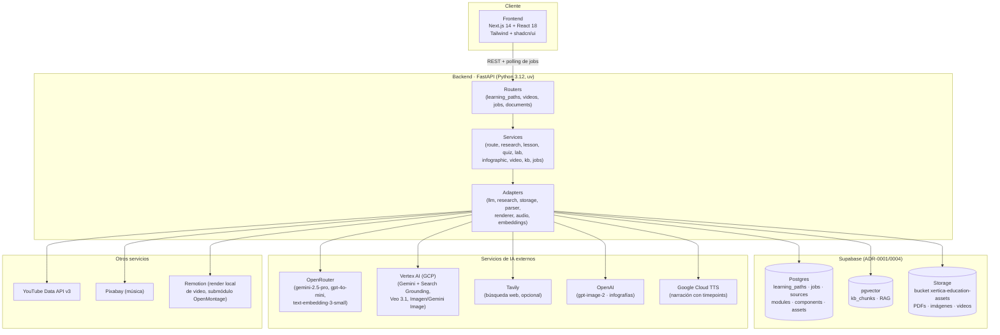
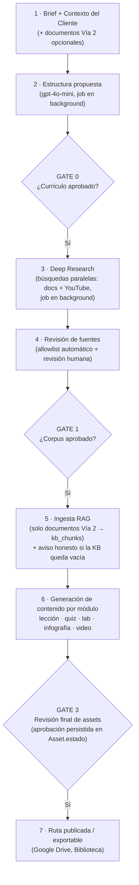
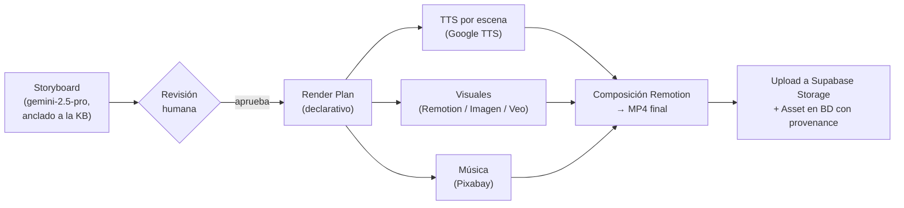

# Informe de Arquitectura — Xertica Education (MVP)

> Documento ejecutivo-técnico: visión superficial pero completa de la arquitectura,
> los servicios elegidos (y por qué), los modelos de IA por tipo de contenido y el
> costo promedio de crear una ruta. Para profundizar en cualquier decisión, cada
> sección referencia su ADR en `docs/adr/`.
>
> Última actualización: 2026-07-10 · Precios referenciales a esta fecha (verificar tarifas oficiales antes de presupuestar).

---

## 1. Qué es el producto (en 3 líneas)

Xertica Education **orquesta la generación asistida por IA de rutas de aprendizaje corporativas**: un diseñador instruccional describe un tema, la IA propone la estructura curricular, y pipelines generan lecciones, quizzes, infografías, guías de laboratorio y videos. Todo pasa por **compuertas de aprobación humana (Gates)**: la IA propone, el humano aprueba, y solo entonces se desbloquea la siguiente fase.

---

## 2. Mapa conceptual de la arquitectura

**Patrón central del backend** (ADR-0002/0004): cada servicio tiene `interface + implementación real + mock`, y cada repositorio tiene **fallback in-memory** cuando las credenciales son placeholder — el MVP corre completo sin ninguna clave configurada.

---

## 3. Servicios elegidos y por qué (vs. alternativas)

| Servicio | Rol en el sistema | Por qué se eligió para el MVP | Alternativas descartadas |
|---|---|---|---|
| **Supabase** | Base de datos (Postgres), vectores (pgvector), storage de archivos y todo en uno | Una sola pieza cubre BD + RAG + archivos con tier gratuito y cero ops; pgvector evita un servicio de vectores dedicado (ADR-0001) | Pinecone/Weaviate (servicio extra solo para vectores), AWS RDS+S3 (3 servicios, más configuración) |
| **FastAPI** | API backend | Async nativo (jobs en background), tipado Pydantic para contratos DTO, velocidad de desarrollo en Python (mismo lenguaje que los SDKs de IA) | Django (pesado para una API), Node/Express (ecosistema IA más débil en tipado) |
| **Next.js 14 + shadcn/ui** | Frontend | App Router + componentes accesibles listos (Radix); iteración rápida de UI con Tailwind | SPA con Vite (sin SSR), librerías de componentes cerradas |
| **OpenRouter** | Gateway multi-modelo LLM | **Una API key y una factura para todos los modelos de texto** (Gemini, GPT, Claude); cambiar de modelo es un string en `settings.model_names`, sin código nuevo | SDK individual por proveedor (N keys, N facturas, migraciones con código) |
| **Vertex AI (GCP)** | Búsqueda grounded, Veo, Imagen | Xertica es partner de Google Cloud; **Veo e Imagen solo existen ahí**; Search Grounding da búsqueda web nativa | — (exclusivos del ecosistema Google) |
| **Tavily** *(opcional, ADR reciente)* | Búsqueda web del Deep Research | URLs limpias (sin redirects proxy), 5-10× más rápido y barato que grounding; se activa con `TAVILY_API_KEY`, si no cae a Gemini grounding | Brave Search (sin snippets para LLM), Perplexity (caja negra), Exa |
| **Remotion + OpenMontage** | Render de video programático | Video como componentes React → determinista y versionable; render local sin costo por minuto de SaaS (ADR-0008/0010) | APIs SaaS de video (costo por render), FFmpeg puro (muy bajo nivel) |
| **Google Cloud TTS** | Narración de videos | Devuelve **timepoints palabra por palabra** → subtítulos sincronizados sin transcriber externo (ADR-0012 video) | ElevenLabs (mejor voz, más caro, sin timepoints nativos), Whisper para re-transcribir (paso extra) |
| **YouTube Data API v3** | Búsqueda de videos para módulos | API oficial con metadata (canal, duración, vistas) para el allowlist de canales confiables | Scraping (frágil, ToS) |
| **Pixabay** | Música de fondo | Gratis y libre de licencias | Bibliotecas de pago |
| **uv / pnpm / turbo** | Tooling del monorepo | Instalaciones 10-100× más rápidas que pip/npm; turbo orquesta apps | pip+venv, npm/yarn |

---

## 4. Modelos de IA por tipo de generación

| Generación | Modelo | Vía | Notas |
|---|---|---|---|
| Estructura curricular (Gate 0) | `gpt-4o-mini` | OpenRouter | Rol `route_structurer` (ADR-0014); barato, JSON confiable |
| Deep Research — búsqueda | `gemini-2.5-flash` + Google Search Grounding | Vertex AI | O **Tavily** si hay API key (swap automático) |
| Deep Research — ranking y detección de tecnologías | `gemini-2.5-flash` (Vertex) o `gpt-4o-mini` (OpenRouter con Tavily) | según buscador activo | Prompts centralizados en `apps/api/prompts/research.py` |
| Lección | `gemini-2.5-pro` | OpenRouter | Rol `lesson_generator` (default del adapter) |
| Quiz | `gemini-2.5-pro` | OpenRouter | Rol `quiz_generator` |
| Guía de laboratorio | `gemini-2.5-pro` | OpenRouter | Rol `lab_generator`, con grounding RAG + fuentes aprobadas |
| Storyboard de video (guionista) | `gemini-2.5-pro` | OpenRouter | Rol `scriptwriter`; system prompt más grande del proyecto (~10.5k chars) |
| Vinculación fuente↔módulo (linker) | `gpt-4o-mini` | OpenRouter | ADR-0012; re-rankea, no busca |
| Infografía | `gpt-image-2` | OpenAI | Genera PNG con branding; PDF derivado con Pillow |
| Ilustraciones dentro del video | `gemini-3.1-flash-image` | Vertex AI | Solo escenas `ai_illustration` |
| Clips de video generativo | `veo-3.1` | Vertex AI | Solo escenas `ai_video` (máx. 1 por video, ADR-0017) |
| Narración (voz) | Google Cloud TTS | GCP | Timepoints → captions word-level |
| Embeddings de la KB (RAG) | `text-embedding-3-small` (1536 dim) | OpenRouter | ADR-0006; métrica coseno, índice HNSW |

> Nota: `settings.model_names` incluye `infographic_design: claude-sonnet` como entrada aspiracional — la infografía real del MVP usa `gpt-image-2`.

---

## 5. Flujo de creación de una ruta (con Gates)

**Todo lo pesado corre como Job asíncrono** (`queued → running → completed | failed`) y el frontend hace polling a `/jobs/{id}` — la API nunca se bloquea.

## 5b. Pipeline de un video (el asset más complejo)

---

## 6. Dónde se persiste cada cosa (ADR-0020..0023)

| Información | Dónde vive | Detalle |
|---|---|---|
| Estructura de la ruta (módulos, fuentes, contexto) | `learning_paths.details` (JSONB) | Fuente de verdad de la **estructura** |
| Artefactos generados (PDFs, imágenes, MP4) | Bucket `xertica-education-assets` | Paths `{ruta}/{módulo}/{tipo}/...`; URL pública en el MVP |
| Estado de aprobación por contenido | Tabla `assets` (`estado`) + espejo en el JSON | El Spine se **materializa perezosamente** al generar/aprobar |
| Aprobaciones de workflow (storyboard, lab guide) | `details.approvals` | Sobreviven refresh y multi-dispositivo |
| Conocimiento RAG | `kb_chunks` (pgvector) | Solo documentos del cliente (Vía 2, ADR-0011) |
| Trabajos asíncronos | Tabla `jobs` (`result` JSONB) | Incluye reporte de ingesta y costo de renders |

---

## 7. Costo promedio de crear una ruta

### Costo por asset individual

| Asset | Cómo se calcula | Costo típico |
|---|---|---|
| Estructura curricular | 1 llamada gpt-4o-mini | < $0.01 |
| Deep Research (corrida completa) | 1 detección + N búsquedas + 1 ranking | $0.05 – $0.20 con Gemini grounding (~$0.035/búsqueda) · **~$0.01 con Tavily** (tier gratis: 1k/mes) |
| Lección | 1 llamada gemini-2.5-pro (~2-4k tokens out) | $0.02 – $0.05 |
| Quiz | 1 llamada gemini-2.5-pro | $0.02 – $0.04 |
| Guía de laboratorio | 1 llamada gemini-2.5-pro (+RAG) | $0.03 – $0.06 |
| Infografía | 1 imagen gpt-image-2 (PNG; el PDF es derivado local) | $0.05 – $0.20 según calidad |
| Ingesta RAG (por documento) | embeddings text-embedding-3-small | < $0.01 |
| **Video (90-120s)** | **Fórmula del propio sistema** (`service.py`): `(escenas Veo × $0.20) + (ilustraciones × $0.04) + ($0.004 × segundos)` | $0.50 – $0.90 |

> El costo del video es el único que el sistema **calcula y persiste** por render (`jobs.result.cost_usd`). Dato real observado en producción: **$0.54** por un video (2 escenas Veo + ilustración + ~25s de las demás). Un video sin escenas generativas (solo Remotion + TTS) cuesta ~$0.40-0.50; cada escena Veo agrega $0.20.

### Escenarios de ruta completa (4-5 módulos típicos)

| Escenario | Composición | Costo IA estimado |
|---|---|---|
| **Ruta ligera** | 4 lecciones + 4 quizzes + 1 lab + 1 infografía + **0 videos** | **$0.35 – $0.70** |
| **Ruta estándar** | 4 lecciones + 4 quizzes + 2 labs + 2 infografías + **2 videos** | **$1.60 – $2.80** |
| **Ruta completa** | 5 lecciones + 5 quizzes + 3 labs + 3 infografías + **5 videos** | **$3.50 – $6.00** |

Reglas rápidas para estimar de memoria:
- **Todo el texto de una ruta (lecciones+quizzes+labs) cuesta menos que un solo video.**
- Cada **video** suma ~$0.50-0.90; cada **infografía** ~$0.10; el resto es casi ruido.
- Las **regeneraciones cuentan igual**: si el revisor pide regenerar un video 3 veces, son 3 renders. El costo dominante de una ruta es `videos × regeneraciones`.
- Costos fijos mensuales: $0 en el MVP (Supabase free tier, Remotion local, Tavily free tier). El gasto es 100% variable por uso.

---

## 8. FAQ técnica rápida

**¿Por qué los jobs son asíncronos con polling y no websockets?**
Simplicidad del MVP: `POST` devuelve `job_id`, el frontend consulta `/jobs/{id}` cada 1.5s. Sin infraestructura de sockets ni colas externas; `BackgroundTasks` de FastAPI basta al volumen actual.

**¿Qué pasa si un servicio externo se cae o no hay API keys?**
Regla de oro #1 (ADR-0002): ninguna feature bloquea a otra. Cada servicio tiene mock y cada repositorio fallback in-memory — la demo corre completa sin ninguna credencial.

**¿El RAG usa todos los documentos que encuentra el Deep Research?**
No (ADR-0011/0016): solo los **documentos subidos por el cliente** (Vía 2) se indexan en la KB. Las URLs del Deep Research se aprueban como referencias directas y los videos de YouTube se vinculan por módulo, sin copiarse.

**¿Cómo se controla la calidad de lo generado?**
Tres niveles: (1) Gates de aprobación humana en cada fase; (2) grounding visible — cada contenido declara si está anclado a documentos del cliente (`kb-grounded`) o solo al objetivo del módulo; (3) provenance: cada asset guarda con qué prompt, modelo y fuentes se generó.

**¿Se puede cambiar un modelo de IA sin tocar código?**
Sí, para los de texto: `MODEL_NAMES` (env var JSON) mapea rol → modelo vía OpenRouter. Los generativos de Google (Veo/Imagen) y el buscador se configuran en settings/env (`TAVILY_API_KEY` activa Tavily).

**¿Qué costo fijo tiene la infraestructura?**
Prácticamente cero: Supabase free tier, render de video local (Remotion), sin servidores dedicados. Escala de costos = volumen de generación.

---

## 9. Referencias

- `CONTEXT.md` — lenguaje ubicuo y dominio completo.
- `docs/adr/` — decisiones: persistencia (0004, 0020-0023), RAG (0006, 0011), video (0007-0010, 0015-0017), research (0011, 0016-0017), generación (0014, 0018-0019).
- `docs/analisis-persistencia.md` — auditoría que originó los ADR-0020..0023.
- `apps/api/config/settings.py` — mapa vivo de modelos y servicios configurados.
