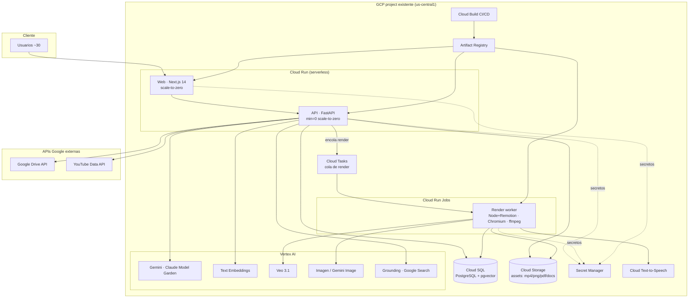

# Migración a Google Cloud Platform — Análisis de desacople, refactorización, arquitectura y costo

> **Estado:** análisis técnico (no es un ADR ni un cambio de código).
> **Fecha:** 2026-08-10 · **Precios:** lista pública `us-central1`, agosto 2026 (referenciales).
> **Alcance de despliegue:** dentro de un **GCP project existente**.
> **Vocabulario:** se usan los términos de [`CONTEXT.md`](../../CONTEXT.md) (Ruta, Módulo, Componente, Asset, Source, KB, Job, Gate).

---

## 1. Resumen ejecutivo

**Veredicto: la migración es factible sin reescritura.** La arquitectura ya está pensada para
Cloud Run + una base Postgres gestionada (ver [`architecture.md`](./architecture.md)), y casi todos
los servicios externos viven detrás de un **puerto** (`interface.py`/`base.py`) con `mock.py`, lo que
hace intercambiable la implementación. La migración es mayormente **contenerización +
re-plataformado GCP-nativo**, no un rediseño.

El objetivo elegido es **GCP-native completo**, definido por tres decisiones:

| # | Decisión | Objetivo |
| :-- | :-- | :-- |
| 1 | **Capa de datos** | Cloud SQL for PostgreSQL (+`pgvector`) + Cloud Storage (GCS), todo dentro del project |
| 2 | **LLMs de texto** | Vertex AI nativo (Gemini directo + embeddings Vertex + Claude vía Model Garden) |
| 3 | **Render de video** | Worker separado: Cloud Tasks + Cloud Run Jobs, con estado de jobs externalizado |

**Esfuerzo total estimado:** **M–L** (medio-alto), concentrado en 3 focos:

| Foco | Esfuerzo | Por qué |
| :-- | :-- | :-- |
| Externalizar jobs + worker de render | **L (Alto)** | Hoy el render corre in-process con estado en memoria y disco local efímero |
| Repos Supabase (PostgREST) → Cloud SQL (SQL) | **M–L** | Los repos usan el query-builder de `supabase-py`, no SQL estándar |
| Infografía + Google Drive sin puerto | **M** | `httpx`/SDK crudos incrustados en service/router; hay que crear el puerto |
| Contenerización + Vertex nativo + Secret Manager + IaC | **S–M** | Trabajo mecánico; los puertos ya existen para LLM/embeddings/storage |

**Costo estimado (1 mes, 30 usuarios / ~5 activos por día): ≈ US$265/mes** con precios de lista y
**Cloud Run en scale-to-zero (`min-instances=0`)**, donde **Veo (video IA) y Cloud SQL son las dos
partidas dominantes**. Con Veo 3.1 *Fast* o menos clips, baja a **≈ US$170/mes**. Ver §8.

---

## 2. Alcance y supuestos

- **Usuarios:** 30 en total; **~5 usuarios activos por día** (baja concurrencia, patrón de estudio de contenido).
- **Volumen mensual asumido** (declarado y **ajustable** — es la principal palanca de costo):

  | Actividad | Volumen/mes | Notas |
  | :-- | :-- | :-- |
  | Rutas estructuradas (LLM) | ~20 | Gate 0 |
  | Videos ~2 min renderizados (incl. re-renders) | ~50 | Gate 2/3 |
  | Infografías | ~40 | |
  | Lessons / Quizzes / Labs (texto) | ~160 | síncronos hoy |
  | Deep Research | ~20 | Gate 1 |
  | Ingesta KB (embeddings) | decenas de docs | Vía 2 |

- **Región:** `us-central1` (coincide con `google_cloud_location` en [`settings.py`](../../apps/api/config/settings.py)).
- **Precios:** de lista, agosto 2026; **no** descuentan los ~US$300 de créditos ni los *free tiers* mensuales (se anotan aparte). Verificar contra las fuentes de §8 antes de comprometer presupuesto.
- **No incluye:** costo de dominios/CDN externo, soporte pagado, ni licencias de terceros que se mantengan fuera de GCP (Tavily, Pixabay, OpenRouter si se conservan como respaldo).

---

## 3. Inventario de servicios y grado de desacople

El backend sigue el patrón **puertos/adaptadores**: `interface.py`/`base.py` (puerto) + `service.py`
+ `mock.py`, con factories en [`config/dependencies.py`](../../apps/api/config/dependencies.py) que
auto-seleccionan mock ↔ real detectando la cadena `placeholder` en las keys. Ese patrón es lo que
hace la migración barata **donde se respeta**. Hay dos patrones conviviendo:

- **A) Factory limpio** (fácil de intercambiar): `get_embedder()`, `get_linker()`,
  `get_storage_adapter()`, `get_documentation_client()`, `get_route_structurer()`,
  `get_kb_chunk_repository()`.
- **B) Instanciación directa / cableada** (difícil de intercambiar): `SupabaseJobRepository()`,
  `SupabaseLearningPathRepository()`, `VideoService()`, `InfographicService()` y tres
  `OpenRouterLLMAdapter()` para quiz/lesson/lab
  ([`dependencies.py:27,30,35,53,57-59`](../../apps/api/config/dependencies.py)).

### Tabla de acoplamiento

| Servicio externo | ¿Puerto? | ¿Mock? | Acoplamiento | Evidencia |
| :-- | :-- | :-- | :-- | :-- |
| Supabase Postgres — repos factory (kb, sourcing, documents, source_links, approved) | Sí | Sí | **Medio** | usan el query-builder PostgREST, no SQL |
| Supabase Postgres — jobs, learning_path | Sí, pero sin swap real | Fallback horneado en la clase | **Medio-Alto** | `dependencies.py:27,30` instancian la clase Supabase directo |
| Supabase Storage | Sí (`storage/base.py`) | Sí | **Bajo** ⚠ | clase duplicada; Video usa `SupabaseStorageAdapter()` propio (`video/service.py:71`) |
| OpenRouter (LLM texto) | Sí (`llm/base.py`) | Embebido | **Bajo-Medio** | instanciado en ≥4 sitios (`dependencies.py:57-59`, `video/service.py:67`) |
| OpenAI embeddings | Sí | Sí | **Bajo** (canónico) | `adapters/embeddings/` vía `get_embedder()` |
| Vertex Veo / Imagen | Puerto vestigial/roto | Embebido (`is_mock`) | **Alto** | `video/service.py:70-71` los instancia sin DI |
| Google Cloud TTS | Parcial | Embebido | **Medio-Alto** | `video/service.py:68` lo instancia sin DI |
| Tavily / Google Search (research) | Duck-typing (sin ABC) | Degradación por `enabled` | **Bajo-Medio** | `get_documentation_client()` ya intercambia |
| Google Drive (export) | **No** | **No** | **Alto** | `routers/google_drive.py`: `httpx` crudo + URLs `googleapis.com` incrustadas (`:8,26-27,285-316`) |
| YouTube Data API | **No** | Degradación + mocks | **Medio-Alto** | lógica dispersa en `ResearchService` |
| pgvector / KB | Sí (`kb/interface.py`) | Sí | **Bajo** | todo contenido en `similarity_search` (RPC `match_kb_chunks`) |
| OpenAI Images `gpt-image-2` (infografía) | **No** | **No** (lanza si falta key) | **Alto** | `infographic/service.py`: `import httpx` (:19), `create_client` (:23), `model:"gpt-image-2"` (:320), POST directo a `api.openai.com` (:327) |

### Observaciones de ejecución (relevantes para el refactor)

- **No hay cola ni worker.** Los jobs corren en el mismo proceso: `asyncio.create_task` (video),
  `BackgroundTasks` (structure/KB/research). Quiz/lesson/lab/infografía y parseo de documentos son
  **100% síncronos dentro del request HTTP**.
- **Estado de jobs en memoria** (`video/service.py:74-76`: `_fallback_jobs`, `_render_tasks`;
  además `_fallback_store` en repos) → **no sobrevive reinicios ni escala horizontal**.
- **Render pesado:** subprocess de **Remotion (Node + Chrome headless)** con **timeout de 20 min**
  (`video/executor.py`), más Playwright/Chromium (screenshots) y ffmpeg/ffprobe. Escribe en
  `/tmp/render_{job_id}` y copia visuales a `composer/public/{job_id}` (**disco local efímero**).
- **Cliente Supabase síncrono** invocado dentro de `async def` sin `to_thread` → **bloquea el event
  loop** bajo carga.
- **URLs hardcodeadas `http://localhost:8000/static/...`** para servir infografías
  (`infographic/service.py:513-514`, `adapters/storage/supabase.py:54`) → se rompen fuera de local.
- **Sin autenticación**; CORS `allow_origins=["*"]` en `main.py` (marcado "restringir antes de prod").
- **No existen Dockerfiles** ni configs de despliegue → contenerizar es trabajo nuevo.

---

## 4. Esfuerzo de refactorización

Clasificación **S** (bajo, mecánico) / **M** (medio) / **L** (alto, estructural).

### 4.1 Capa de datos: Supabase → Cloud SQL (PostgreSQL + pgvector) — **M–L**

**Por qué no es trivial:** los repos están escritos contra el **query-builder de `supabase-py`
(PostgREST)** — `.table().select().eq().in_().execute()` y `.rpc(...)` — no contra SQL estándar. No
basta cambiar el connection string.

Opciones:
- **(Recomendada) Reescribir los repos con SQLAlchemy/`asyncpg`.** Todo el acceso está aislado
  detrás de interfaces (`repositories/*/interface.py` o `kb/interface.py`), así que se sustituye la
  implementación sin tocar services. La lógica pgvector está **contenida** en un solo punto
  (RPC `match_kb_chunks`), que pasa a ser una consulta SQL con el operador `<=>` de `pgvector`.
- (Alternativa) Correr **PostgREST** como contenedor aparte apuntando a Cloud SQL — evita reescribir,
  pero añade un componente que operar y no elimina el acoplamiento a PostgREST. No recomendada.

Puntos a atender: recrear el schema (`supabase/migrations/`) en Cloud SQL, instalar la extensión
`vector`, portar la función `match_kb_chunks`, y **decidir qué hacer con RLS** (hoy activo sin
políticas y usando la key `service_role`): al mover auth fuera de Supabase, RLS deja de aplicar y la
autorización debe resolverse en la app o en IAM. Los fallbacks in-memory (`_fallback_store`, datos
demo horneados) deben **retirarse** para producción.

### 4.2 Jobs + worker de render separado — **L (el foco más caro)**

Es el cambio estructural principal. Hoy el render es un `asyncio.create_task` con estado en memoria;
para escalar y sobrevivir reinicios hay que:

1. **Externalizar el estado de jobs** a Cloud SQL (tabla `jobs`), eliminando `_fallback_jobs` y
   `_render_tasks` como fuente de verdad.
2. **Encolar** la petición de render en **Cloud Tasks** (o Pub/Sub) en vez de `create_task`.
3. **Extraer el pipeline de `video/executor.py` a un contenedor worker** que corra como
   **Cloud Run Job** (o servicio con concurrency=1), con la imagen que incluye Node+Remotion, Chromium
   y ffmpeg. El worker toma el job, renderiza, sube el MP4 a **GCS** y marca el job en Cloud SQL.
4. **Sustituir disco local** (`/tmp`, `composer/public`) por rutas efímeras del contenedor + subida a
   GCS; **eliminar las URLs `localhost:8000`** y servir assets vía URL firmada de GCS.
5. Envolver las llamadas Supabase/Cloud SQL síncronas en `to_thread` **o** migrar a un driver async
   para no bloquear el event loop.

### 4.3 Infografía y Google Drive: crear puerto — **M (Alto acoplamiento actual)**

- **Infografía** (`services/infographic/service.py`) llama `gpt-image-2` con `httpx` crudo y usa
  `create_client` de Supabase dentro del service. Migrar a **Vertex Imagen / Gemini image** implica
  **crear un puerto** (p. ej. `adapters/image/base.py` + `VertexImageAdapter` + `mock.py`) y sacar la
  persistencia del service hacia el storage adapter.
- **Google Drive** (`routers/google_drive.py`) tiene la integración (descarga/subida multipart) escrita
  con `httpx` **dentro del router**. Para producción conviene aislarla en un adapter y mover las
  credenciales OAuth a **Secret Manager**. Sigue siendo una API de Google, así que no cambia de proveedor.

### 4.4 LLMs de texto: OpenRouter → Vertex AI nativo — **M**

El puerto ya existe (`adapters/llm/base.py`). Se crea un **`VertexLLMAdapter`** (Gemini directo;
Claude vía **Model Garden**) y se **centraliza** la construcción en un `get_llm_adapter(role)` en
`dependencies.py`, reemplazando los `OpenRouterLLMAdapter()` dispersos (`dependencies.py:57-59`,
`video/service.py:67`). El mapa rol→modelo ya está en `settings.model_names`.

### 4.5 Embeddings, Veo/Imagen/TTS, Storage — **S–M**

- **Embeddings** (`get_embedder()` ya es factory): nuevo `VertexEmbedder` tras `BaseEmbedder`. **S.**
- **Veo/Imagen/TTS** ya son de Vertex/GCP; falta **formalizar el puerto** y moverlos a DI en
  `dependencies.py` en lugar de instanciarse dentro de `VideoService` (`video/service.py:68-71`). **M.**
- **Storage**: consolidar los dos adaptadores duplicados y crear `GcsStorageAdapter` tras el puerto
  (`storage/base.py`); es el ejemplo más limpio de swap. **M.**

### 4.6 Contenerización + secretos + IaC — **S–M**

Crear **Dockerfiles** (no existen): imagen de API (Python `uv` + ffmpeg + Chromium + Node/Remotion
para el worker), imagen de Web (Next.js standalone). Mover `.env` a **Secret Manager**. Añadir
CI/CD con **Cloud Build** + **Artifact Registry**. Restringir CORS y añadir autenticación (fuera del
alcance de datos, pero requisito antes de exponer a usuarios).

---

## 5. Arquitectura objetivo en GCP



### Mapeo actual → GCP

| Hoy | GCP objetivo | Esfuerzo |
| :-- | :-- | :-- |
| FastAPI local | **Cloud Run** (API, min=0 scale-to-zero, request-based) | S |
| Next.js local | **Cloud Run** (o Firebase App Hosting) | S |
| Render in-process | **Cloud Run Jobs** + **Cloud Tasks** + estado en Cloud SQL | **L** |
| Supabase Postgres + pgvector | **Cloud SQL for PostgreSQL** + `pgvector` (+ `match_kb_chunks`) | **M–L** |
| Supabase Storage | **Cloud Storage (GCS)** | M |
| OpenRouter (texto) | **Vertex AI** (Gemini + Claude Model Garden) | M |
| OpenAI embeddings | **Vertex AI text-embeddings** | S |
| OpenAI `gpt-image-2` (infografía) | **Vertex Imagen / Gemini Image** | M |
| Veo / Imagen / TTS | **Vertex AI / Cloud TTS** (ya lo son) — formalizar DI | M |
| Tavily / Google Search | **Gemini + Grounding con Google Search** | S–M |
| Google Drive / YouTube | Igual (APIs de Google) + Secret Manager | S |
| Secretos en `.env` | **Secret Manager** | S |
| — (no existe) | **Artifact Registry** + **Cloud Build** | S |

---

## 6. Servicios / APIs a habilitar

En el project existente (ajustar `PROJECT_ID`):

```bash
gcloud config set project PROJECT_ID

gcloud services enable \
  run.googleapis.com \                # Cloud Run (Web, API) + Cloud Run Jobs (worker)
  cloudbuild.googleapis.com \         # CI/CD de imágenes
  artifactregistry.googleapis.com \   # registro de imágenes de contenedor
  sqladmin.googleapis.com \           # Cloud SQL for PostgreSQL (+pgvector)
  storage.googleapis.com \            # Cloud Storage (assets)
  secretmanager.googleapis.com \      # secretos (.env → Secret Manager)
  cloudtasks.googleapis.com \         # cola de render (o pubsub.googleapis.com)
  aiplatform.googleapis.com \         # Vertex AI: Gemini, Claude, embeddings, Veo, Imagen, Grounding
  texttospeech.googleapis.com \       # narración TTS (es-US-Neural2-B)
  iam.googleapis.com \                # service accounts y roles
  logging.googleapis.com \            # logs
  monitoring.googleapis.com           # métricas/alertas

# Integraciones externas de Google (si se conservan):
gcloud services enable drive.googleapis.com youtube.googleapis.com

# Opcional (si se usa IP privada a Cloud SQL vía VPC):
# gcloud services enable vpcaccess.googleapis.com servicenetworking.googleapis.com
```

> Nota: con el **conector integrado de Cloud SQL** para Cloud Run (socket Unix) **no** hace falta
> VPC connector ni su costo asociado. Solo se necesita `vpcaccess`/`servicenetworking` si se opta por
> IP privada por VPC.

---

## 7. Configuración de despliegue

Snippets de referencia (ajustar nombres, SA y región). No ejecutar sin revisar.

### 7.1 Artifact Registry + Service Accounts

```bash
gcloud artifacts repositories create xertica --repository-format=docker --location=us-central1

# SA de runtime (API/worker) con permisos mínimos
gcloud iam service-accounts create xertica-run --display-name="Xertica runtime"
SA="xertica-run@PROJECT_ID.iam.gserviceaccount.com"
for ROLE in \
  roles/cloudsql.client \
  roles/storage.objectAdmin \
  roles/secretmanager.secretAccessor \
  roles/aiplatform.user \
  roles/cloudtasks.enqueuer \
  roles/run.invoker ; do
  gcloud projects add-iam-policy-binding PROJECT_ID --member="serviceAccount:$SA" --role="$ROLE"
done
```

### 7.2 Cloud SQL (PostgreSQL + pgvector)

```bash
gcloud sql instances create xertica-pg \
  --database-version=POSTGRES_16 --edition=ENTERPRISE \
  --tier=db-custom-1-3840 --region=us-central1 \
  --storage-type=SSD --storage-size=10GB --no-assign-ip   # solo conector/privado
gcloud sql databases create xertica --instance=xertica-pg
# En la BD:  CREATE EXTENSION IF NOT EXISTS vector;
# Portar schema (supabase/migrations/) + función match_kb_chunks (operador <=> de pgvector).
```

- **HA (`--availability-type=REGIONAL`)** aproximadamente **duplica** el costo del rubro Cloud SQL;
  para un piloto se puede dejar **ZONAL** (sin HA) con backups automáticos.

### 7.3 Cloud Storage (assets)

```bash
gcloud storage buckets create gs://xertica-education-assets \
  --location=us-central1 --uniform-bucket-level-access
# Acceso vía SA (roles/storage.objectAdmin). Servir con URLs firmadas; retirar localhost:8000.
```

### 7.4 Secret Manager (mapa `.env` → secretos)

Secretos a crear (de [`.env.example`](../../apps/api/.env.example) y `settings.py`):
`supabase-*` (temporal si se conserva), `db-url` (Cloud SQL), `openai-key`/embeddings,
`veo-key`, `youtube-api-key`, `tavily-api-key` (si se conserva), `pixabay-api-key`,
`google-drive-client-id`/`api-key`. Las credenciales de Vertex/GCS/TTS/Veo/Imagen dejan de ser keys
en `.env`: se resuelven por la **service account** de Cloud Run (ADC), eliminando
`google_application_credentials`.

```bash
printf '%s' "$VALUE" | gcloud secrets create db-url --data-file=-
# En el deploy:  --set-secrets=DATABASE_URL=db-url:latest,...
```

### 7.5 Cloud Tasks (cola de render)

```bash
gcloud tasks queues create render-queue --location=us-central1
# La API encola un HTTP task hacia el worker; el worker responde 2xx al completar/aceptar.
```

### 7.6 Cloud Run — API, Web y Worker

```bash
# Imágenes (Cloud Build)
gcloud builds submit apps/api --tag us-central1-docker.pkg.dev/PROJECT_ID/xertica/api
gcloud builds submit apps/web --tag us-central1-docker.pkg.dev/PROJECT_ID/xertica/web
# Imagen del worker: base con Node+Remotion, Chromium y ffmpeg + el pipeline de video/executor.py

# API (scale-to-zero para ahorrar; conector de Cloud SQL; secretos)
gcloud run deploy xertica-api \
  --image us-central1-docker.pkg.dev/PROJECT_ID/xertica/api \
  --region us-central1 --service-account $SA \
  --min-instances=0 --cpu=2 --memory=2Gi --concurrency=40 \
  --add-cloudsql-instances=PROJECT_ID:us-central1:xertica-pg \
  --set-secrets=DATABASE_URL=db-url:latest \
  --set-env-vars=GOOGLE_CLOUD_PROJECT=PROJECT_ID,GOOGLE_CLOUD_LOCATION=us-central1,STORAGE_BUCKET=xertica-education-assets

# Web (scale-to-zero)
gcloud run deploy xertica-web \
  --image us-central1-docker.pkg.dev/PROJECT_ID/xertica/web \
  --region us-central1 --min-instances=0 --cpu=1 --memory=512Mi \
  --set-env-vars=NEXT_PUBLIC_API_URL=https://xertica-api-....run.app

# Worker de render (Cloud Run Job: CPU alta, timeout largo, sin concurrencia)
gcloud run jobs create xertica-render \
  --image us-central1-docker.pkg.dev/PROJECT_ID/xertica/render \
  --region us-central1 --service-account $SA \
  --cpu=4 --memory=8Gi --task-timeout=1800s --max-retries=1 \
  --add-cloudsql-instances=PROJECT_ID:us-central1:xertica-pg \
  --set-secrets=DATABASE_URL=db-url:latest
```

> **Nota sobre `min-instances=0` (scale-to-zero):** ahorra costo — la API solo factura durante
> requests, mayormente dentro del *free tier* — a cambio de **cold starts** (unos segundos en la
> primera petición tras estar inactiva) y, sobre todo, de **no** poder sostener trabajo en memoria:
> cualquier job en proceso (structure/KB/research/video in-process) muere si la instancia se apaga.
> Por eso `min=0` es plenamente seguro **una vez externalizado el estado de jobs a Cloud SQL** (§4.2).
> Los endpoints síncronos (quiz/lesson/lab/infografía) no se ven afectados salvo por el cold start.

### 7.7 Variables de entorno clave

`GOOGLE_CLOUD_PROJECT`, `GOOGLE_CLOUD_LOCATION=us-central1`, `DATABASE_URL` (Cloud SQL),
`STORAGE_BUCKET`, `MODEL_NAMES` (JSON rol→modelo Vertex), URLs públicas de API/Web (CORS restringido),
más los secretos de §7.4. Se **elimina** `GOOGLE_APPLICATION_CREDENTIALS` (se usa ADC de la SA).

---

## 8. Tabla presupuestal — 1 mes (30 usuarios / ~5 activos/día)

Precios de lista `us-central1`, agosto 2026. Supuestos de volumen: §2.

### Infraestructura

| Rubro | Base de cálculo | Est. mensual |
| :-- | :-- | --: |
| Cloud Run — API | **min=0 (scale-to-zero)**, request-based, mayormente *free tier* | ~$5 |
| Cloud Run — Web | scale-to-zero + free tier | ~$5 |
| Cloud Run Jobs — Render worker | ~50 renders × ~10 min × 4 vCPU / 8 GiB | ~$10 |
| Cloud SQL PostgreSQL (pgvector) | 1 vCPU / 3.75 GiB, 10 GB SSD, **sin HA** | ~$75 |
| Cloud Storage (GCS) | ~10–20 GB + egress bajo | ~$3 |
| Artifact Registry + Secret Manager | imágenes + ~10 secretos | ~$2 |
| Cloud Tasks / Build / Logging | dentro de *free tier* | ~$0 |
| **Subtotal infraestructura** | | **~$100** |

### IA / Modelos (Vertex AI + TTS)

| Rubro | Base de cálculo | Est. mensual |
| :-- | :-- | --: |
| **Veo 3.1** (video IA) | ~40 clips × 8 s × $0.40/s (Standard 720p) | ~$128 |
| **Imagen / Gemini Image** | ~60 imágenes × ~$0.04–0.07 (infografía + ilustraciones) | ~$6 |
| **Gemini** (scriptwriter, structure, lesson/quiz/lab, research) | mayormente Flash; Pro en guion | ~$15 |
| **Vertex embeddings** | ingesta KB del piloto | ~$5 |
| **Grounding con Google Search** | ~20 deep-research | ~$10 |
| **Cloud TTS (Neural2)** | ~95k chars/mes (bajo el 1M gratis) | ~$0 |
| **Subtotal IA** | | **~$164** |

### Total

| | Est. mensual |
| :-- | --: |
| Subtotal infraestructura | ~$100 |
| Subtotal IA | ~$164 |
| **TOTAL** | **~$265 / mes** |

### Sensibilidad (la estimación se mueve sobre todo por Veo y Cloud SQL)

| Palanca | Efecto | Total resultante |
| :-- | :-- | --: |
| Veo 3.1 **Fast** ($0.10/s) en vez de Standard | IA ~$164 → ~$68 | **~$170** |
| Mitad de videos con Veo (20 clips) | IA −~$64 | **~$200** |
| Cloud SQL con **HA (REGIONAL)** | +~$75 | **~$340** |
| Doble de todo el volumen (uso alto) | IA ~×2 | **~$440** |
| Créditos GCP (~$300) / free tiers activos | descuento primer mes | **puede acercarse a ~$0 el 1er mes** |

**Fórmula de costo por video (referencial, ya presente en el código** —
`video/service.py:1463`**):**
`costo ≈ (nº_ai_video × $0.20) + (nº_ai_illustration × $0.04) + (0.004 × duración_seg)`
— confirma que **Veo** (`ai_video`) domina el costo unitario del render.

**Fuentes a verificar** (precios cambian): Vertex AI pricing (Gemini/Veo/Imagen/embeddings/Grounding),
Cloud Run pricing, Cloud SQL for PostgreSQL pricing, Cloud Text-to-Speech pricing, Cloud Storage
pricing. Todos en `cloud.google.com/<producto>/pricing`, región `us-central1`.

---

## 9. Riesgos, recomendaciones y fases

### Enfoque por fases (reduce riesgo y adelanta valor)

- **Fase 1 — Levantar en GCP (S–M):** contenerizar API+Web → Cloud Run **con `min-instances=0`**
  (scale-to-zero, para ahorrar); migrar datos a Cloud SQL (+pgvector) y archivos a GCS; LLMs a Vertex;
  Secret Manager; CORS + auth mínima. **Ojo con scale-to-zero:** los endpoints síncronos
  (quiz/lesson/lab/infografía) funcionan bien, pero los jobs con estado en memoria
  (structure/KB/research/video in-process) se pierden si la instancia se apaga → conviene
  **adelantar la externalización del estado de jobs a Cloud SQL** (§4.2, parte de Fase 2). Si se
  posterga, mantener `min-instances=1` **solo** mientras el render siga in-process.
- **Fase 2 — Robustez y escala (L):** extraer el **worker de render** (Cloud Tasks + Cloud Run Jobs),
  externalizar el estado de jobs, quitar disco local/URLs `localhost`, y desacoplar quiz/lesson/lab
  del request síncrono si la latencia molesta.

### Riesgos principales

| Riesgo | Impacto | Mitigación |
| :-- | :-- | :-- |
| Reescritura de repos PostgREST → SQL introduce regresiones | Alto | Cobertura de tests por repo antes de migrar; migrar uno a uno detrás de la interfaz |
| RLS deja de aplicar al salir de Supabase | Alto (seguridad) | Resolver autorización en la app/IAM antes de exponer usuarios |
| Render excede recursos/timeout en Cloud Run Jobs | Medio | `--task-timeout=1800s`, CPU=4/Mem=8Gi; medir con videos reales |
| Costo de Veo se dispara con el uso | Medio | Usar Veo **Fast**, limitar clips por video, cuotas/alertas de presupuesto |
| Sin autenticación hoy (CORS `*`) | Alto | Añadir auth + restringir CORS antes de producción |
| Cold starts (scale-to-zero elegido) | Medio | Imagen ligera y dependencias mínimas; `min-instances=1` puntual solo si la latencia molesta |
| Scale-to-zero pierde jobs en memoria / in-process | **Alto en Fase 1** | Externalizar estado de jobs a Cloud SQL (§4.2) antes de confiar en `min=0`; los endpoints síncronos no se ven afectados |

### Deuda técnica a limpiar durante la migración

- **Adaptadores de storage duplicados** (uno lo salta `VideoService`) → consolidar tras el puerto.
- **Archivos con sufijo `" 2"`** (p. ej. `docs/arquitectura/informe-arquitectura-mvp 2.md`) → residuos
  de copia; eliminar.
- **Regla `placeholder` repetida** para decidir mock↔real → centralizar en un helper de config.
- **Fallbacks in-memory y datos demo horneados** en repos/servicios → retirar para producción.

---

### Referencias del repositorio

- Dominio y glosario: [`CONTEXT.md`](../../CONTEXT.md)
- Arquitectura objetivo previa: [`architecture.md`](./architecture.md)
- DI / factories: [`apps/api/config/dependencies.py`](../../apps/api/config/dependencies.py)
- Configuración: [`apps/api/config/settings.py`](../../apps/api/config/settings.py)
- Pipeline de render: `apps/api/services/video/executor.py`, `apps/api/services/video/service.py`
- Infografía: `apps/api/services/infographic/service.py`
- Export Drive: `apps/api/routers/google_drive.py`
