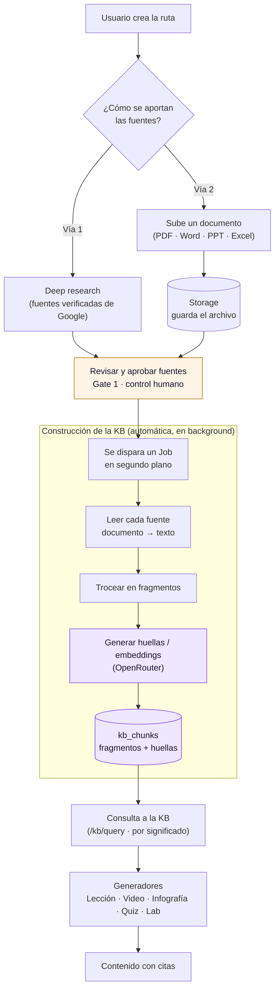
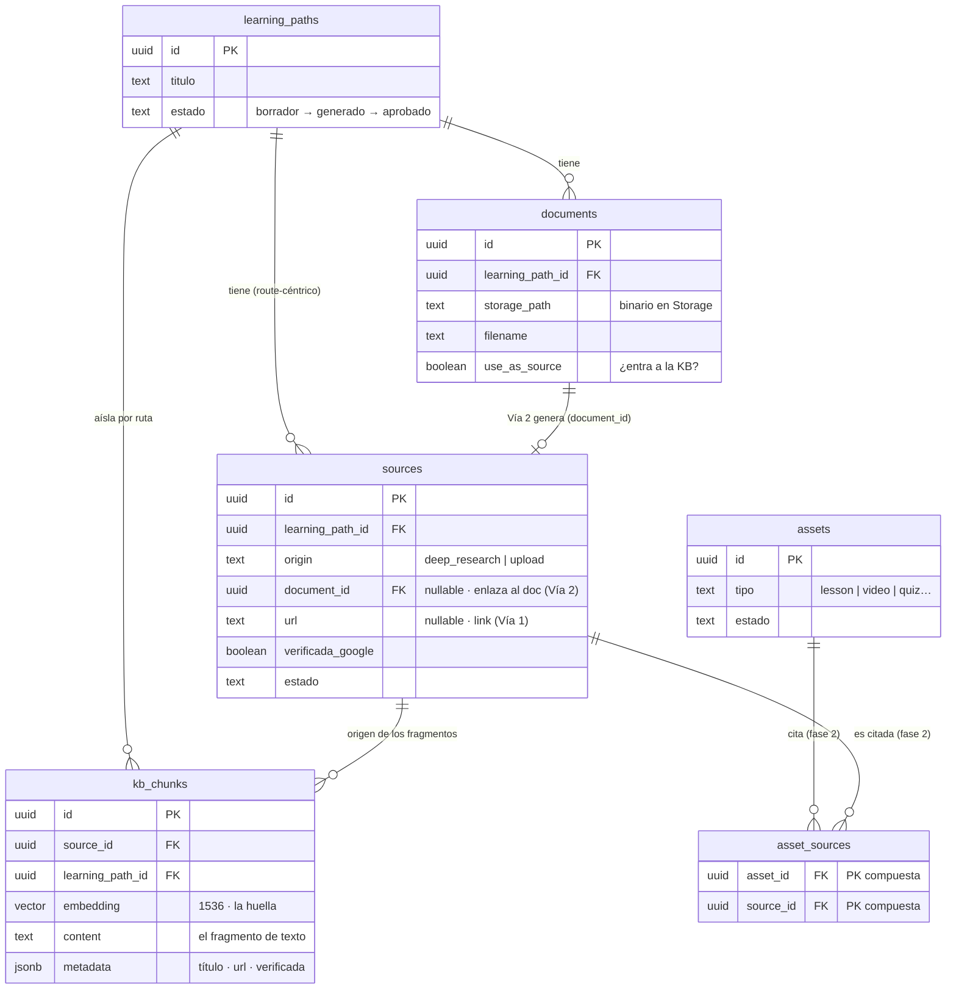

# Knowledge Base (RAG) — Resumen de la rama `feature/KB-RAG`

> **Autor del trabajo:** Joseph · **Rama:** `feature/KB-RAG` · **Actualizado:** 8 Jul 2026
> Documento a grandes rasgos (no técnico) de qué se hizo y por qué. Para el detalle
> fino ver los ADRs y issues enlazados al final.

---

## En una frase

Se construyó el **cerebro de referencia** de la plataforma: un sistema que toma las
fuentes aprobadas de una ruta (videos, documentos oficiales y archivos que sube el
usuario), las convierte en conocimiento consultable, y responde **con citas** para que
todo el contenido generado (lecciones, videos, infografías…) esté **respaldado en
material verificable**.

Eso es lo que se llama **KB (Knowledge Base) con RAG**: *Retrieval-Augmented
Generation* — "generación aumentada por recuperación".

---

## El problema que resuelve

La regla de oro del producto es que **ningún contenido puede inventarse**: cada asset
debe apoyarse en fuentes verificables (de Google o aportadas por el cliente). Para eso
hacía falta una pieza que:

1. Guarde las fuentes de forma ordenada.
2. Las "entienda" para poder buscar por significado, no solo por palabras exactas.
3. Devuelva, ante una pregunta, los fragmentos más relevantes **con su cita**.

Antes de esta rama, esa pieza era solo un esqueleto vacío. Ahora funciona de punta a
punta.

---

## Qué se construyó (a grandes rasgos)

### 1. La base de conocimiento consultable
- Las fuentes se **trocean** en fragmentos y cada fragmento se convierte en un
  **"vector"** (una huella numérica de su significado). Eso permite buscar por
  *significado* ("háblame de Gemini") y no por coincidencia literal.
- Esos vectores se guardan en la base de datos (Supabase, con la extensión `pgvector`).
- Un buscador semántico devuelve los fragmentos más parecidos a una consulta, **con la
  fuente de la que salieron**.

### 2. Dos formas de alimentar la KB ("las dos vías")
- **Vía 1 — Deep research:** el sistema busca fuentes verificadas de Google (videos
  oficiales, documentación) automáticamente.
- **Vía 2 — Documentos del usuario:** el cliente sube sus propios archivos
  (PDF, Word, PowerPoint, Excel, texto) y, si marca *"usar como fuente"*, entran también
  a la KB. Esos documentos se **leen y convierten a texto** para poder procesarlos.

### 3. El motor de "huellas" (embeddings) vía OpenRouter
- Las huellas numéricas se generan con un modelo de OpenAI (`text-embedding-3-small`)
  servido a través de **OpenRouter**, reutilizando la clave que el proyecto ya tenía.
- Decisión importante: **no se usa un LLM para "leer" los documentos**, porque un LLM
  tiende a parafrasear y eso rompería las citas. Se usa lectura *textual fiel*.

### 4. Persistencia ordenada de las fuentes
- Se corrigió cómo se guardan las fuentes: ahora **pertenecen a la ruta** desde el
  momento del sourcing (antes el modelo asumía que ya existía el contenido final, lo
  cual no encajaba con el flujo real).

### 5. Un punto de consulta para el resto del equipo
- Se expuso un acceso (`/kb/query`) para que quienes generan lecciones, videos o
  infografías puedan **pedir contexto con citas** a la KB.

### 6. La conexión con el frontend
- La pantalla de *"Nueva ruta"* ahora **sube de verdad** el documento del cliente al
  backend (antes solo lo mostraba en pantalla). Se arregló además un bug por el que el
  selector de archivos no abría.

---

## El flujo, en palabras simples

1. **Creas una ruta** y describes el tema.
2. Opcionalmente **subes un documento** (propuesta, temario) y/o dejas que el sistema
   **busque fuentes** por su cuenta.
3. Revisas las fuentes y las **apruebas** (esto es el "Gate 1", un control humano).
4. Al aprobar, **se pone en marcha (en segundo plano) la construcción de la KB**: se lee
   cada fuente, se trocea, se generan las huellas y se guardan.
5. A partir de ahí, cualquier generador puede **consultar la KB** y recibir fragmentos
   relevantes con sus citas.

> Todo el paso 4 ocurre **sin bloquear** al usuario: la aprobación es inmediata y la
> ingesta corre como una tarea de fondo. Si algo falla, no rompe el flujo.

---

## Diagrama del flujo

> Los recuadros morados marcan el momento clave: **dónde se crean las huellas
> (embeddings) y se guardan en `kb_chunks`**.

*Nota: el diagrama se renderiza automáticamente en GitHub/GitLab y en editores con
soporte Mermaid (VS Code con la extensión, Obsidian, etc.).*

---

## Modelo "route-céntrico" y sus tablas en Supabase

**Qué significa route-céntrico:** la **Ruta** (`learning_paths`) es la raíz de todo. Las
fuentes, los documentos subidos y los fragmentos de la KB **cuelgan directamente de la
ruta**. Esto es así porque las fuentes se aprueban a nivel de ruta en **Gate 1**,
*antes* de que exista ningún contenido final (asset). Por eso `sources`, `documents` y
`kb_chunks` llevan todos una referencia directa a `learning_path_id`.

**Cómo leerlo (de arriba hacia abajo):**
- **`learning_paths`** es el centro: cada ruta agrupa sus fuentes, documentos y fragmentos.
- **`sources`** son las fuentes de la ruta. Tienen un `origin`: `deep_research` (Vía 1,
  con `url`) o `upload` (Vía 2, con `document_id` que apunta al archivo subido).
- **`documents`** son los archivos que sube el usuario; el binario vive en Storage y solo
  entran a la KB si `use_as_source` está activo.
- **`kb_chunks`** son los fragmentos con su **huella (`embedding`)**; guardan tanto
  `source_id` (de qué fuente salió, para la cita) como `learning_path_id` (para aislar la
  búsqueda por ruta). *Este atajo por ruta es lo que evita depender de que existan assets.*
- **`asset_sources`** es el puente para cuando, más adelante (fase 2), los assets citen
  fuentes concretas — hoy está vacío.

> La corrección clave de esta rama (ADR-0007) fue mover el modelo de "las fuentes
> pertenecen a un asset" (que no encajaba con el flujo real) a "las fuentes pertenecen a
> la ruta". Eso es lo que cerró el enlace `kb_chunks → sources` y desbloqueó la escritura
> real de la KB.

---

## Decisiones clave (registradas como ADRs)

| Decisión | En simple | Doc |
| :-- | :-- | :-- |
| **Store de la KB** | Reusar la base de datos existente (Supabase + pgvector) en vez de montar un servicio aparte. | ADR-0001 / ADR-0006 |
| **Motor de huellas** | OpenAI `text-embedding-3-small` (1536) vía **OpenRouter**; con simulación cuando no hay clave. | ADR-0006 |
| **Fuentes de la ruta** | Las fuentes pertenecen a la **ruta** desde el sourcing (route-céntrico), no al asset. | ADR-0007 |
| **Parsing de documentos** | Lectura **textual fiel** con librerías (no LLM); formatos modernos; el binario se guarda como fuente de verdad. | ADR-0008 |

---

## Estado: qué funciona hoy

- ✅ Base de datos de la KB creada y en la nube (tabla de fragmentos + búsqueda por similitud).
- ✅ Huellas reales generadas con **OpenRouter** (verificado en vivo).
- ✅ Guardado y lectura de fuentes y documentos contra la base real.
- ✅ Subida de documentos desde el frontend.
- ✅ Ciclo completo probado de punta a punta (subir → procesar → consultar → limpiar).
- ✅ Suite de pruebas automáticas en verde.

## Qué falta (deuda consciente, fuera de alcance)

- **Deep research real:** hoy las fuentes de la Vía 1 usan contenido simulado; falta el
  rastreo real de YouTube/Google (territorio de Arantza).
- **Documentos escaneados / tablas complejas:** el lector actual cubre documentos
  digitales; los escaneados necesitarán un motor más pesado (MinerU/OCR) como fase 2.
- **Mostrar en la UI** los documentos ya subidos y el progreso de la ingesta.

---

## Dónde mirar (para el detalle)

- **Decisiones:** [`docs/adr/0006`](adr/0006-kb-rag-ingestion-embeddings.md) ·
  [`0007`](adr/0007-source-route-centrica-sourcing.md) ·
  [`0008`](adr/0008-document-parsing-via2-ingestion.md)
- **Mapas de decisiones:** [`docs/decisions/`](decisions/)
- **Issues cerrados:** [`docs/issues/completed/issue-09`](issues/completed/issue-09-sourcing-database-repository.md)
  (fuentes) · [`issue-10`](issues/completed/issue-10-kb-rag-ingestion.md) (KB/RAG)
- **Contexto de dominio:** [`CONTEXT.md`](../CONTEXT.md) (glosario: KB, Chunk, Embedding, Grounding, Document)
