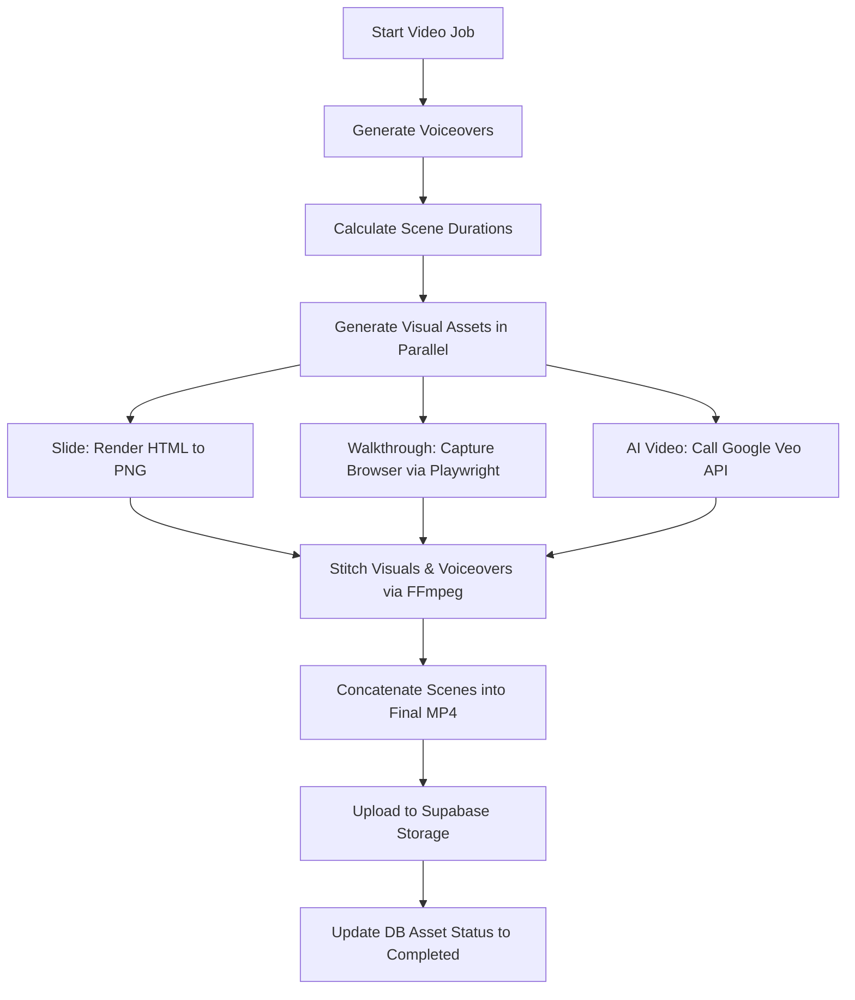

# Product Requirements Document (PRD) — Video Creation Service

## 1. Overview & Objectives
The Video Creation Service is an independent backend component of the Xertica Education platform. It is responsible for programmatically generating short, high-quality, and pedagogically effective educational video capsules (~2 minutes) based on scripts and storyboards.

To ensure developers can build, run, and test this service independently, it features:
1. **Dual-Input Endpoints:** Trigger rendering either using a database ID or by submitting a raw storyboard payload directly.
2. **Mock-First Capabilities:** Instant completion mocks for frontend integration tests.
3. **Pluggable Architecture:** A clean separation between the HTTP layer, the service orchestrator, and external rendering/audio adapters (TTS, Playwright, Google Veo).

---

## 2. User Flow & HITL Integration
To ensure the authoring tool is efficient and doesn't create bottlenecks, the video generation workflow behaves as follows:

* **Optional Storyboard Review:** Reviewing and approving the script/storyboard (Gate 2) is **optional**. By default, users can click "Generate Video" immediately from the main interface. The system will auto-generate the script, synthesize the voiceover, capture the visuals, and render the MP4 in a single background pipeline.
* **Dedicated Approval Tab:** If an editor wants to review, edit, or approve the script and storyboard before rendering, they do so in a dedicated **Approval** tab (not inside the main module content dropdown). This keeps the main lesson-planning dashboard clean and uninterrupted.

---

## 3. Pedagogical Strategy & Cost Control (Hybrid Scenes)
A pure AI-generated video (e.g. using Google Veo for every scene) is both prohibitively expensive and educational counter-productive for software training. A student learns best when seeing code walkthroughs or concise bullet slides.

Therefore, the system uses a **Hybrid Scene Pipeline** where each scene in a video is categorized by a `visual_type`:

| Visual Type | Description | Cost | Pedagogical Value | Implementation |
| :--- | :--- | :--- | :--- | :--- |
| `slide` | Text, code blocks, or simple diagrams. | Free ($0) | High (structured summary) | HTML template rendered to image via Playwright |
| `walkthrough` | Screen capture of code running or cloud dashboard. | Free ($0) | High (hands-on execution) | Playwright automated browser interaction & capture |
| `ai_video` | Concept metaphor or video transition. | High | Medium (engagement boost) | Google Veo model API |

### Word-Budget & Cost Constraint
* The storyboard generator LLM must respect a **Word Budget** (~150 words per minute).
* The storyboard generator must limit `ai_video` scenes to a maximum of **1 per module** (e.g., only the intro scene) to control Google Cloud costs.

---

## 4. Technical Architecture & Storage Strategy
The rendering engine is built as a lightweight, Python-native pipeline running directly inside the FastAPI container.

### Storage Strategy
* **Temporary Assets:** Individual scene audio files (`scene_{i}.mp3`), slide screenshots (`scene_{i}.png`), and captured browser walkthroughs are stored locally in the container's `/tmp` directory. They are deleted immediately after the final compilation to save storage costs.
* **Final MP4 Videos:** Uploaded to **Supabase Storage** in a public `videos` bucket. The public URL is saved back to the database. If the Supabase bucket is full or unreachable, the system falls back to saving files locally and serving them from a local static directory.

### Rendering Technologies
1. **Voiceover (TTS):** Google Cloud Text-to-Speech SDK utilizing premium WaveNet or Journey voices.
2. **Visual capture:** Playwright headless Chrome to render slides (HTML/CSS) and record walkthrough animations.
3. **Assembly & Stitching:** FFmpeg CLI invoked via Python's `subprocess` to synchronize scene audio/visual durations and concatenate scenes.

---

## 5. Data Schema

### Storyboard Schema (JSON)
The input to the video generation service is a structured list of scenes:

```json
{
  "title": "Configuring Supabase pgvector",
  "total_word_budget": 150,
  "scenes": [
    {
      "scene_number": 1,
      "narration": "In this video, we will learn how to enable pgvector on Supabase to store embeddings.",
      "visual_type": "slide",
      "visual_config": {
        "title": "Enabling pgvector",
        "bullets": [
          "Supabase uses Postgres under the hood.",
          "pgvector adds support for vector similarity searches."
        ]
      }
    },
    {
      "scene_number": 2,
      "narration": "To do this, we execute the create extension command in our database SQL editor.",
      "visual_type": "walkthrough",
      "visual_config": {
        "url": "https://supabase.com/docs/guides/database/extensions/pgvector",
        "highlight_selector": "code",
        "actions": ["scroll_to_element"]
      }
    },
    {
      "scene_number": 3,
      "narration": "Now let's see how our vector database acts as the long-term memory for our AI.",
      "visual_type": "ai_video",
      "visual_config": {
        "prompt": "Abstract representation of neural connection pathways glowing blue, digital art, loopable",
        "duration_seconds": 4
      }
    }
  ]
}
```

---

## 6. API Endpoints

### 1. Generate Video
Spawns an asynchronous background job to render the video.

* **URL:** `/videos/generate`
* **Method:** `POST`
* **Request Body:**
```json
{
  "component_id": "3fa85f64-5717-4562-b3fc-2c963f66afa6",
  "custom_storyboard": null,
  "use_mock": false
}
```
* **Response:**
```json
{
  "job_id": "8b51d8b9-8fe8-444f-bc14-b15b135bb25a"
}
```

### 2. Get Video Job Status
Retrieve progress and final MP4 URL.

* **URL:** `/videos/jobs/{job_id}`
* **Method:** `GET`
* **Response (Running):**
```json
{
  "job_id": "8b51d8b9-8fe8-444f-bc14-b15b135bb25a",
  "status": "rendering",
  "progress": 65,
  "result": null
}
```
* **Response (Completed):**
```json
{
  "job_id": "8b51d8b9-8fe8-444f-bc14-b15b135bb25a",
  "status": "completed",
  "progress": 100,
  "result": {
    "video_url": "https://storage.supabase.co/v1/storage/public/videos/module-1-capsule.mp4",
    "duration_seconds": 45.2,
    "cost_usd": 1.25
  }
}
```

---

## 7. Technical Pipeline (Execution Steps)

The backend processes the video rendering in the background as follows:



1. **Audio Synthesis (Google Cloud TTS):** Send the `narration` text of each scene to Google Cloud TTS to create `scene_{i}.mp3` and extract its exact duration.
2. **Visual Asset Generation:**
   * For `slide` type: Renders the title/bullets using a local HTML template in a headless browser via Playwright and captures a screenshot (`scene_{i}.png`).
   * For `walkthrough` type: Navigates to the target page via Playwright, performs actions, and records the browser screen for the exact duration of the scene's audio.
   * For `ai_video` type: Triggers Google Veo generation using the prompt and duration.
3. **Scene Composition:** Execute `ffmpeg` to overlay the scene's audio on top of the generated visual.
4. **Final Assembly:** Concatenate all individual scenes into a single MP4, add background music (optional), and optimize for web streaming.
5. **Upload & Clean up:** Upload the final file to Supabase Storage and remove temporary files from `/tmp`.
